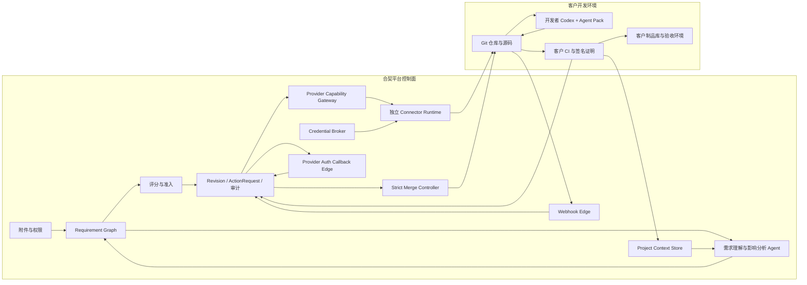
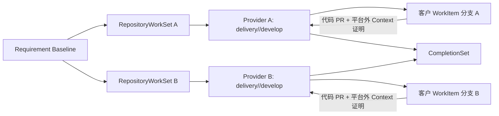

# 易有料·合契（Inforvans Accord）产品设计

- 中文名称：易有料·合契
- 英文名称：Inforvans Accord
- 产品简称：合契 / Accord
- 品牌主张：让预期与交付，合于一契。 / From intent to delivery, in accord.
- 日期：2026-07-25
- 文档状态：已完成最终书面确认；多 Git Provider、跨仓库控制平面和平台外源码边界补充设计已确认，对应实施计划已完成修订并进入书面复核
- 产品级别：生产级 V1 / GA 目标设计，不以功能原型或不完整试用版作为正式交付口径
- 主要场景：企业内部业务团队与研发团队协作，兼容外部供应商参与的甲乙方交付
- 核心价值：减少需求遗漏、歧义和业务到技术误译造成的返工
- 目标范围：中小型软件项目，以及版本化支持矩阵中明确验证过的 Java、JavaScript/TypeScript、Python 框架组合

## 1. 产品定义

合契是一套结构化需求理解与研发交付控制平台。它连接业务需求方、内部研发团队和受邀的外部供应商，通过统一需求知识图谱、由客户侧生成、CI 证明分析来源并由开发侧确认且由平台保存的项目代码画像、双侧评分和确认、平台签名的正式需求基线、Git 控制元数据以及可追溯验收闭环，把“业务想要什么”稳定地转换成“开发应当实现什么”。

合契首先解决需求误解造成的返工，同时完整覆盖四类相关问题：

1. 业务需求不能稳定表达为可理解、可验证的目标和预期结果。
2. 研发团队不能快速判断需求会影响哪些模块、接口、数据、权限、状态和测试。
3. 需求版本、责任人、评分、建议和确认过程无法可靠追溯。
4. 开发结果与已确认需求之间缺少准确候选、验收和修正闭环。

合契不是普通 PRD 编辑器，也不是另一个 Jira。平台中的“文档”是一套带稳定 ID、标准类型、语义关系、附件、评分、Revision 和证据来源的结构化模型，并以业务画布、开发视图、版本差异和验收视图等方式渲染。

### 1.1 产品边界

平台不拉取、不读取、不分析、不保存和不修改客户源码。所有源码读取、代码修改、测试和构建发生在开发者仓库、开发者自己的 Codex 以及客户 CI 环境中。

平台负责：

- 统一 Requirement Graph 和业务需求画布；
- 项目已有代码分析结果形成的 Project Context；
- 需求提取、业务澄清、开发影响初稿和双视图转译；
- 双侧评分、准入门禁、Revision、建议、确认和例外；
- 交付批次、WorkItem、ActionRequest、通知、验收和审计；
- 正式 Requirement Baseline、开发任务包及 Agent Pack 的签名发布、版本化下载和审计；
- 多 Git Provider 的安装实例、仓库绑定、能力准入、分支/PR/check、Webhook、对账和受控合并；
- 严格交付模式下仅对已经存在且验证通过的准确候选调用 Git Provider 合并 API，更新受保护分支引用；平台不生成或编辑代码内容。

开发侧负责：

- 通过平台或 `accordctl` 安装并验证平台提供的签名 Agent Pack；
- 首次分析源码并生成结构化 Project Context 基线；
- 审阅平台生成的需求影响分析并提出修改建议；
- 使用本地 Codex 依据正式开发任务包开发；
- 将绑定准确 commit 的 Context Patch、结构化开发说明或经 CI 证明的 `no_context_change` 提交给平台；
- 运行测试、生成制品和签发客户 CI 证明。

### 1.2 产品价值闭环

```text
业务方表达目标和材料
→ Agent 形成结构化需求块并发现缺口
→ 平台基于 Project Context 生成开发影响初稿
→ 开发方审阅、评分并提出结构化建议
→ 双方确认同一 Requirement Revision
→ 平台冻结正式需求基线、拆分仓库级 WorkItem 并创建交付分支引用
→ 开发者通过 accordctl 获取签名开发任务包，使用原生 Git 和本地 Codex 开发
→ 客户 CI 验证代码、测试和 Context Patch
→ 需求方对准确候选验收
→ 失败按实现错误、需求变化或环境问题分别处理
→ 平台衡量需求型返工是否下降
```

## 2. 目标用户与交付模式

### 2.1 主要用户

| 用户 | 核心任务 |
| --- | --- |
| 业务需求人员 | 在业务域中提出需求、补充材料、理解预期效果、处理开发建议并验收 |
| 业务侧最高负责人 | 确认本侧授权、评分策略、高风险需求和业务侧例外 |
| 开发负责人 | 审阅影响分析、组织技术评估、拆分 WorkItem、分配开发并处理冲突 |
| 开发评估人员 | 对技术可行性、范围、成本、风险和测试进行人工评分与说明 |
| WorkItem 开发人员 | 获取签名开发任务包，使用原生 Git 和本地 Codex 开发、测试并提交 Context Patch |
| 业务侧验收负责人 | 以业务侧身份对绑定准确 Revision、提交和制品的候选执行最终验收 |
| 项目负责人 | 配置项目、成员、交付模式、评分策略、通知和外部协作 |
| 外部供应商成员 | 以开发侧受限成员身份参与指定 Requirement、WorkItem 和交付批次 |

### 2.2 标准协作模式与严格交付模式

两种模式共用相同的需求、评分、Revision、Project Context 和验收模型。差异只在代码进入受保护分支时由谁拥有最终合并权。

| 能力 | 标准协作模式 | 严格交付模式 |
| --- | --- | --- |
| 正式需求发布 | 平台签名并发布 Requirement Baseline 与开发任务包 | 相同，且任务包绑定严格模式能力快照 |
| 工作 PR 最终合并 | 企业现有负责人或 Git 合并队列 | 合契受控 Merge Controller |
| 合并前检查 | 需求版本、人员、范围、测试、Context Patch 和 hold | 相同检查，并在最终合并瞬间重新验证 |
| 管理员绕过风险 | 可能存在，平台负责发现、冻结和恢复 | 常规路径不可绕过 |
| 适用场景 | 内部可信研发团队 | 外包、核心业务和强审计项目 |
| 对外保证 | 强检查、完整审计和异常恢复 | 不可绕过的合并执行门禁 |

需求发布路径始终采用强管控，不随代码合并模式变化。正式 Requirement Baseline、开发任务包和历史 Revision 只在平台事实库与受控对象存储中版本化；Git 仓库不作为需求文档事实库。

### 2.3 V1 支持边界

生产级 V1 支持：

- 一个业务项目关联一个或多个仓库，仓库可以跨 Git Provider；
- 一个 Requirement 拆分为一个或多个仓库级 WorkItem，并由 CompletionSet 汇总交付；
- 每个仓库最多参与一个正常执行中的 DeliveryBatch，同时允许未来需求持续准备；
- 同一部署可同时接入 GitHub Cloud / Enterprise Server、GitLab SaaS / Self-Managed、Gitee / Gitee Enterprise、Azure DevOps Services / Server 和 Bitbucket Cloud / Data Center；
- 其他 Git 服务可通过版本化 Provider SPI 接入，未经 Accord 认证时只允许普通模式；
- 支持矩阵中明确验证过的语言、框架和主版本；
- 企业内部业务与研发协作，以及受邀供应商参与；
- 标准协作与严格交付两种模式。

V1 不承诺：

- 平台服务端直接理解源码；
- 任意语言、框架、反射、动态生成或运行时行为的完整理解；
- 大型 monorepo 的无边界分析与任意规模承诺；
- 跨 Provider 原子合并、自动回滚已经合并的仓库或伪造分布式事务；
- 自动替代业务、开发和验收责任人作出确认；
- 自动解决业务语义冲突、代码冲突或无法证明的影响范围；
- 无审计的管理员绕过；
- 把模型输出当作绝对事实或代码正确性的独立证明。

## 3. 核心原则

### 3.1 一个事实模型，两种角色视图

业务侧画布和开发侧视图必须来自同一个 Requirement Graph 和同一个 Requirement Revision。平台不得维护两份可以独立变化的业务文档和开发文档。

### 3.2 业务意图与代码事实分离

- Requirement Graph 描述业务希望未来怎样工作。
- Project Context 保存客户侧生成、由 CI 证明分析来源并经开发侧确认的结构化代码事实主张；每条 claim 仍明确区分 observed、inferred、unknown 和 conflict。
- Impact Assessment 描述某个需求在某个 Project Context Version 下可能影响什么。
- 实现后的代码变化通过 Context Patch 更新代码事实，不能反向覆盖业务意图。

### 3.3 平台不接触源码

Project Context、Context Patch 和完成证明由开发者 Codex 与客户 CI 在客户环境中生成。平台只接收统一结构的分析、引用、哈希和签名证明。

### 3.4 Agent 提议，人类负责

Agent 可以提取、补全、转译、评分、建议关系和生成报告，但不能替代责任人批准需求、接受评分例外、确认开发或通过验收。

### 3.5 持续需求流与交付冻结分离

上一批代码仍在开发时，未来需求可以继续提出、澄清、评分和确认。只有需求进入具体 DeliveryBatch 时，准确 Revision 才被冻结，并与仓库级 WorkItem、开发分支引用和签名任务包绑定。

### 3.6 正式语义只由平台发布

草稿、对话、建议和处理过程留在平台。双方确认后的 Requirement Baseline 由平台签名后通过平台 API、界面和 `accordctl` 发布；开发者可下载、验证并供本地 Codex 使用，但不能直接改写平台中的正式需求版本。Git 只保存代码与 Provider 原生元数据，不保存平台生成的需求正文。

### 3.7 不确定性显式化

普通 `unknown` 或 `conflict` 不能进入可开发状态。非阻塞未知项必须转为双方接受的 `accepted_unknown`，记录影响、责任人、解决期限和逾期动作。阻塞性未知项不能通过评分或管理员例外绕过。

### 3.8 评分不能掩盖关键缺口

需求侧和开发侧必须分别达到项目阈值，并满足各必需维度最低分。平均分不能用来补偿技术不可行、验收缺失或阻塞问题。

### 3.9 实现错误不伪装成需求变化

实现不符合已确认需求时，在原 Requirement Revision 下创建 CorrectionRun；只有业务预期、范围或验收标准变化时才创建新 Revision。

### 3.10 模式保证必须准确表述

标准协作模式允许 Git 原生合并，因此只能承诺强检查、检测和恢复。只有严格交付模式在控制全部最终合并入口时，才承诺不可绕过。

### 3.11 所有关键对象均版本化

Requirement Revision、Project Context、AssessmentPolicy、Agent Pack、附件、评分结果、批准回执、DeliveryCommitment、Context Patch、候选和验收都必须绑定准确版本和内容哈希。

## 4. 总体架构



### 4.1 平台组件

| 组件 | 职责 |
| --- | --- |
| Requirement Graph Service | 保存业务域、需求块、关系、Revision、字段所有权和双视图投影 |
| Project Context Store | 保存客户侧生成、CI 证明来源并由开发侧确认的结构化代码画像物化视图 |
| Requirement Agent | 理解文字、语音转写和材料，生成业务表单、缺口问题和结构化需求块 |
| Impact Agent | 基于 Requirement Graph 与 active Project Context 生成开发影响初稿 |
| Translation Agent | 在不改变事实来源的前提下进行业务与技术视图转译 |
| Assessment Service | 管理 AssessmentPolicy、评分、门禁、异常检测和例外 |
| Workflow Service | 管理 Revision、建议、确认、WorkItem、验收、CorrectionRun 和 ActionRequest |
| Development Package Service | 对 Requirement Baseline、WorkItem、验收条件、附件引用和 Agent Pack 清单生成签名开发任务包，并通过平台 API 与 `accordctl` 发布 |
| Identity / Tenancy | 创建并维护唯一权威 RepositoryBinding，绑定 tenant、project、Provider family、规范化 endpoint identity、installation identity 和 Provider immutable repository ID |
| Provider Registry | 保存安装实例、适配器版本、Binding 的技术注册关联和能力快照；只能引用 Identity 中已激活的 RepositoryBinding，不能创建第二套仓库归属事实 |
| Provider Capability Gateway | 只暴露分支、ChangeRequest、check、保护策略、Webhook、对账和受控合并等类型化能力，不暴露源码能力 |
| Connector Runtime | 以独立 Java 进程运行内置或外部 Provider 适配器，实施 mTLS、端点允许清单、限流、幂等和凭据隔离 |
| Credential Broker | 根据安装实例和工作负载身份向 Connector 提供短期 Provider 凭据；业务库只保存外部密钥引用 |
| Webhook Edge | 在规范化前完成 Provider 专用验签、大小限制、去重和短期加密留存 |
| Provider Auth Callback Edge | 使用与 Webhook Edge 相同的签名镜像但独立身份，单次消费 OAuth/App 回调并只向控制面转发 opaque receipt |
| Merge Controller | 仅在严格模式对准确候选执行最终合并，不生成代码内容 |
| Attachment Service | 使用私有 OSS 保存附件、权限、版本、内容哈希和审计 |
| Event and Notification Service | 保存追加式事件，可靠投递用户动作请求和外部提醒 |

### 4.2 权威数据边界

| 内容 | 权威来源 | 其他位置的角色 |
| --- | --- | --- |
| 需求草稿、业务问题、建议、评分和确认 | 平台 | Git 不保存协商正文 |
| 统一 Requirement Graph | 平台 | Git 不保存需求正文副本 |
| 正式 Requirement Baseline / 开发任务包 | 平台 PostgreSQL 与受控 OSS | 开发者通过 API/`accordctl` 获取带版本、摘要和签名的只读副本 |
| 初始 Project Context 基线 | 开发侧生成并经 CI 证明 | 平台保存 active 物化视图 |
| Context Patch / no-context-change | 开发者 Codex 与客户 CI 生成，平台接收待生效包 | 平台在 Provider 证明真实合并后激活对应版本；Git 中无需保存平台文档 |
| 源码 | 客户仓库 | 平台不可访问 |
| 构建制品 | 客户制品库 | 平台只保存 digest、链接和证明 |
| 图片和材料附件 | 平台私有 OSS | Requirement Graph 保存附件 ID 与版本 |
| ActionRequest、通知、审计事件 | 平台 | Git 只提供分支、PR、check、commit 和 actor 等 Provider 事实 |

### 4.3 生产实现技术基线

V1 平台实现统一采用以下受控技术基线，实施计划和代码不得自行引入并行后端语言或第二套业务事实存储：

- Java 21 + Spring Boot：控制面业务模块、HTTP/Webhook 入口、后台任务、附件扫描、签名、需求发布、严格合并和其他独立安全服务；控制面使用 Spring Modulith 保持模块边界。
- Python 3.12：Agent Runtime、模型调用、评分、评测和结构化代码分析结果处理。Python 进程只接收版本化、无源码的结构化投影和任务契约。
- React + TypeScript：浏览器端产品界面，只消费生成的 OpenAPI 客户端和服务端给出的状态、解释与 `allowed_actions`。
- Java 21 + Picocli + jlink：`accordctl`。发布物自带裁剪后的运行时，不要求开发者预装 Java。
- PostgreSQL：唯一业务数据库技术。控制面业务事实与 Temporal 持久化在生产环境使用独立高可用 PostgreSQL 集群；本地环境可使用同一实例中的独立数据库。需要单写、租约、幂等、协调或短期能力状态时仍以 PostgreSQL 的独立 Schema、角色、约束和事务实现。
- Temporal：只负责跨天、多轮人工确认、重试、超时和失败恢复的持久编排，不作为审批、评分、确认或交付状态的唯一事实来源。
- 私有 OSS/S3 兼容对象存储：保存附件、音频、渲染文档、证据包和其他大型不可变对象。PostgreSQL 只保存对象标识、版本、摘要、权限、保留策略和审计引用。生产适配器必须通过能力矩阵验证版本化、WORM/Object Lock、校验和、多段上传、跨区复制和删除证明；能力不足时相关 GA 能力失败关闭。

首版不依赖 Redis、DynamoDB、Kafka 或另一套业务数据库。允许进程内有界缓存，但缓存必须可丢弃、不得参与授权或状态机判断，也不得成为跨副本协调手段。Webhook Edge、Provider Auth Callback Edge、Attachment Scanner、Signing Service、Credential Broker、Connector Runtime、Merge Controller 等安全组件仍是独立进程，使用独立工作负载身份、数据库角色、网络策略、密钥用途和最小权限；统一使用 Java 不代表合并信任边界或共享高权限凭据。两个 Edge 运行身份使用同一签名镜像，但不得共享 ServiceAccount、数据库角色、加密密钥、入口路径、mTLS audience、队列或 NetworkPolicy。

## 5. 统一需求知识图谱

### 5.1 聚合与节点

`Requirement` 是一次业务变化的生命周期聚合。一个 Requirement Revision 由一个根需求块和若干标准类型的关联需求块组成。

```text
Project
└─ BusinessDomain
   └─ Requirement
      └─ RequirementRevision
         ├─ RequirementBlock[]
         ├─ RequirementRelation[]
         ├─ AttachmentBinding[]
         ├─ DevelopmentView
         ├─ AcceptanceCriterion[]
         ├─ AcceptedUnknown[]
         └─ SemanticDecision[]
```

标准 `RequirementBlock.type` 包含：

- `user_scenario`：目标用户、触发条件、操作和预期结果；
- `business_rule`：约束、计算、资格和边界规则；
- `workflow_state`：流程阶段、状态转换和失败行为；
- `data`：字段、数据来源、保留和一致性要求；
- `permission`：角色、资源和允许或拒绝行为；
- `report_notification`：报表、消息、提醒和升级；
- `non_functional`：性能、安全、可用性、兼容性和迁移要求。

项目可以增加自定义业务域和显示标签，但不能改变标准类型的核心语义。扩展类型必须带命名空间、Schema 和版本。

### 5.2 标准关系

需求块之间使用固定语义关系：

```text
precedes       前置于
depends_on     依赖于
triggers       触发
constrains     约束
affects        影响
conflicts_with 冲突
supersedes     替代
split_from     拆分自
relates_to     一般关联
```

Agent 可以建议关系，只有用户确认后才进入正式图谱。普通关系可以在最终结构化表单中批量确认；冲突、高风险或改变流程顺序的关系单独突出。画布坐标和布局不进入业务语义哈希，正式数据只保存节点 ID、关系类型和关系属性。

### 5.3 附件绑定

附件分为：

- `contractual`：原型、字段表、计算规则、验收样例等，内容哈希参与 Revision；
- `reference`：会议纪要、调研和背景资料，保留版本但新增时不自动使确认失效。

AttachmentBinding 保存附件 ID、版本、内容哈希、类型、用途、权限范围和引用的需求块。临时 OSS 下载地址不进入 Revision 哈希。

### 5.4 Requirement Revision 哈希

内部语义模型使用规范化 JSON。`revision_hash` 的唯一输入为 `JCS({schema_version, requirement_id, revision_no, parent_revision_hash, semantic_payload})`，并使用 SHA-256 计算；`semantic_payload` 至少覆盖：

- Requirement、Revision 和父子关系；
- 全部业务需求块和正式关系；
- 开发侧确认后的影响、风险、WorkItem 和测试映射；
- 验收条件；
- 契约附件 ID、版本和内容哈希；
- AcceptedUnknown 和正式 Decision；
- 生成影响分析所依据的 Project Context Version 与相关 claim digest。

父子关系通过 `parent_revision_hash` 进入顶层哈希输入；其余内容位于 `semantic_payload`。实现不得在顶层和 `semantic_payload` 重复同一字段后以不同值参与哈希。

`revision_hash` 不包含：

- 活跃人员绑定和个人分支；
- 通知、已读状态和处理进度；
- 评分运行时间、批准时间和交付时间；
- DeliveryBatch 分配；
- 平台派生状态。

评分回执、批准回执、人员授权和 DeliveryCommitment 分别绑定 `revision_hash`，由 publication attestation 一并签名，避免哈希自引用和人员变更导致业务语义被错误改写。

## 6. 业务需求画布与录入

### 6.1 画布结构

需求侧默认看到按“业务域一级、标准需求类型二级”组织的可视化画布。需求块是图节点，标准关系是连线。系统自动布局、折叠和过滤；用户不需要手工维护坐标。

Requirement 根节点显示整体业务侧评分、开发侧评分和当前门禁。每个需求块摘要显示：

- 需求名称与预期效果；
- 类型、所属业务域和当前责任人；
- 用户可理解的当前状态；
- 与本块相关的缺口、风险和阻塞徽标；
- 阻塞问题数量；
- 依赖、影响、冲突和替代关系。

点击节点打开完整详情，包括业务内容、开发转译、评分、附件、建议、版本差异、实现证据和验收。画布旁提供来自同一数据的业务域目录、列表、筛选、搜索和聚焦视图；这不是另一份文档。移动端和小屏默认使用目录与详情视图。

### 6.2 新增需求

用户可以在具体业务域和需求类型区域点击新增，也可以从全局“新增需求”进入。当前位置只用于预填分类；全局新增时 Agent 建议业务域和标准类型，用户在最终表单一次确认。弹窗支持：

- 输入一段文字；
- 录制语音并编辑转写结果；
- 上传图片、文档、表格和其他项目允许的材料；
- 上传材料，Agent 建议其属于“影响确认版本”还是“仅作背景”；
- 使用继承自 Requirement 的项目共享权限，或主动选择更窄的成员范围。

语音转写直接进入同一结构化表单供用户编辑，提交表单即视为确认转写，不再增加一次独立弹窗。原始音频默认在提交后删除；只有用户明确选择时才作为参考附件长期保存。

Requirement Agent 根据输入和当前业务图谱生成结构化表单。首屏先显示 Agent 理解的目标、预期效果和“还需要你回答”的阻塞问题；完整字段按需展开，非阻塞缺项允许后续补充：

- 目标用户；
- 当前问题；
- 目标结果；
- 主场景和示例；
- 业务规则；
- 范围和非范围；
- 异常与边界；
- 成功指标；
- 验收预期；
- 缺失信息和建议关系。

需求方可以直接调整表单。确认后 Agent 将其格式化写入 Requirement Graph。原始输入和提取来源保留在审计记录中，但不作为杂乱正文显示在画布中。

### 6.3 双视图

业务视图默认使用业务语言展示目标、场景、规则、关系、预期效果、材料和需要决策的问题。

开发视图在同一 Requirement Revision 上增加：

- Project Context basis；
- 受影响模块、接口、数据、权限和状态；
- 可行性、复杂度、兼容性和迁移风险；
- WorkItem、依赖、范围和开发建议；
- 测试和验收映射；
- 技术未知项和证据引用。

两侧都可以查看另一视图，但只能直接编辑本侧拥有的字段。开发方对业务字段只能提交 DevelopmentProposal，不能直接覆盖。

## 7. Agent Pack 与 Project Context

### 7.1 版本化 Agent Pack

平台提供签名、版本化的 Agent Pack：

```text
accord-agent-pack/
├─ AGENTS.md
├─ skills/
│  ├─ initialize-project-context/
│  ├─ prepare-context-patch/
│  ├─ implement-requirement/
│  ├─ report-development-question/
│  └─ prepare-completion/
├─ schemas/
├─ templates/
├─ validator/
└─ accord-manifest.yaml
```

平台提供安装命令、下载资源、兼容矩阵、文件哈希、签名和升级说明。开发人员负责在本地 Codex 工作区执行安装；客户可以选择把 `AGENTS.md` 或 lock 文件纳入自己的仓库，但平台不要求也不代为提交。每个 RepositoryBinding 在平台中固定 `agent_pack_lock_digest`，`accordctl` 在执行前验证本地资源与该摘要一致；升级由开发侧发起并确认，平台不能在线改变已经绑定到 Requirement Baseline 的 Skill、Schema 或 `AGENTS.md`。

### 7.2 首次 Project Context

首次接入流程：

1. 开发侧使用 `accordctl` 安装并验证 Agent Pack，平台固定对应 `agent_pack_lock_digest`。
2. 开发者 Codex 在客户环境读取源码并生成结构化基线，通过 `accordctl` 上传候选；载荷绑定不可变 Provider、仓库 ID、代码基线 SHA 和 tree hash，不上传源码正文。
3. 客户 CI 校验 Schema、被分析的代码基线 SHA、证据引用、Pack 版本和签名，并通过 OIDC 工作负载身份向平台提交独立 DSSE 证明。
4. 平台只有在 Provider 元数据证明该 SHA 是目标分支当前或明确选择的历史基线，且结构化基线与 CI 证明摘要一致后，才允许进入开发侧确认。
5. 开发侧最高负责人或授权技术负责人查看模块摘要、覆盖率、unknown/conflict 和上传数据清单后确认；不要求逐条 claim 点击确认，详细证据可抽查。
6. 平台激活新的 Project Context Version。

确认前的基线只能预览，不能用于正式需求评分、双边确认和开发任务发布。

Project Context 至少包含：

- `context_version`、`schema_version`、`agent_pack_version` 和 `analyzer_version`；
- 代码基线提交、排除平台目录后的 `code_fingerprint`；
- 模块、职责、接口、实体、数据关系、权限、状态和业务规则；
- 外部依赖、已知限制、测试映射；
- claim、文件、符号、配置和内容哈希证据；
- 覆盖率、未知项、冲突和不支持的动态行为。

代码事实状态统一为：

```text
observed  代码、配置或测试直接证明
inferred  多项证据支持但不是直接声明
unknown   当前无法确认
conflict  不同证据互相冲突
```

### 7.3 需求影响初稿

新需求产生后，平台 Impact Agent 直接读取 active Project Context 和 Requirement Graph，生成开发侧影响初稿。开发人员在平台审阅、补充和修正，不需要每条需求重新运行本地源码分析。

Impact Agent 输出至少包括：

- 分析依据的 Project Context Version；
- 预计影响模块、接口、数据、权限、状态和外部依赖；
- 兼容、迁移、性能和安全风险；
- 建议 WorkItem 与依赖顺序；
- 自动测试和人工验收建议；
- 证据引用、覆盖率、未知项和需要开发方确认的结论。

### 7.4 Context Patch

项目政策要求所有进入受保护开发分支的代码 PR，无论是否由合契需求触发，都包含 Context Patch，或由客户 CI 签署 `no_context_change`。严格交付模式由 Merge Controller 在最终合并时强制执行；标准协作模式通过必需检查、分支保护和合并后对账执行，但当 Git 管理员绕过保护时只能检测、冻结和恢复，不能宣称已经从物理上阻止该次合并。

正常情况下 Context Patch 由 Agent Pack 根据实际 diff 生成并由客户 CI 校验，开发者只审阅摘要和处理冲突、未知或越界差异，不要求手工重复维护一份代码说明文档。

Context Patch payload 通过 `accordctl` 或平台 API 提交，并与实际代码 PR、source head 和目标仓库绑定；它至少包含：

- 起始 Project Context Version 和 lineage；
- Requirement Revision 和 WorkItem（如适用）；
- 改变的模块、接口、数据、权限、状态、规则和测试；
- 新增、更新或失效的证据；
- Agent Pack 和分析器版本。

payload 可以直接绑定 source head，因为它不写回 Git、不会形成 Git 哈希自引用；未知的实际 merge SHA 与 result tree 仍由客户 CI 和 Provider 合并后的外部证明补齐。客户 CI 的 DSSE attestation 单向绑定 `patch_payload_digest + repository/PR/source head/verified target head/result tree/normalized code diff digest`，不向平台发送 diff 正文。

PR CI 在合并前模拟应用并校验 Patch。Patch 在真实 PR 合并前只属于 `pending` 候选。Webhook 确认准确 merge SHA 后，平台按合并顺序应用 Patch，生成新的 active Project Context Version。

平台不把 Project Context、增量 Patch、声明或 CI 证明写回开发分支。平台保存候选、证明和当前物化视图；只有 Provider 证明对应代码真正合并后，待生效 Patch 才成为新的 active Project Context Version。

### 7.5 新鲜度与重建

- 代码合并但缺少有效 Patch：Project Context 立即进入 `stale`。
- Patch 序号缺失：暂停应用后续 Patch 并对账。
- Patch 冲突或无法应用：进入 `rebuild_required`。
- `stale` 或 `rebuild_required` 时仍可录入、澄清并形成业务侧 `B` 评分；暂停开发侧 AI 分 `A`、开发侧综合分 `D` 的定稿、开发确认、双方最终确认和开发任务发布，直到画像恢复或证明该需求不受影响。
- 全量重建必须重新经过开发侧负责人确认。
- 开发中发现画像错误时，提交 DevelopmentAnnotation；平台先标记受影响范围，再进入画像修正或需求 Revision 流程。

### 7.6 证据可信度、上下文复用与失效

平台对 Project Context 的保证边界必须显式展示：

| 可信度标记 | 含义 |
| --- | --- |
| `platform_structure_verified` | 平台已校验 Schema、哈希、签名、引用格式和版本关系，但没有读取源码验证结论本身 |
| `customer_ci_verified` | 客户 CI 已证明分析基于指定仓库 SHA，引用存在，且产物由固定 Agent Pack 和分析器生成 |
| `human_confirmed` | 有权开发负责人已经审阅并确认该 claim 或分析结果 |

一个结论可以同时具有多个标记。业务视图不得把 `platform_structure_verified` 表述成“平台已从源码证明”。高风险结论只有达到 AssessmentPolicy 要求的可信度组合，才能通过门禁。

Project Context Version 更新时，平台先生成 ContextChangeImpact，按 Requirement Revision 引用的 claim ID、claim digest、Patch 来源和需求所处阶段执行影响判断。Revision 中的 `analysis_basis` 是确认时的不可变开发前快照，不会因为后续代码画像自然前进而被替换或重算 `revision_hash`：

- 引用 claim 的内容和可信度没有变化：生成 ContextBasisReuse 记录，既有评分和确认可以继续有效；
- 尚未发布的 Requirement 遇到相关 claim 新增、变更、删除、冲突或覆盖等级下降：使依赖它的影响分析、评分和待发布资格失效，返回对齐流程；
- 已发布 Requirement 的已授权 WorkItem 产生预期代码事实变化：保留原 analysis basis 和 Revision，比较实际 Patch 与已批准影响、WorkItem 和验收范围；一致时只更新 Context lineage、Completion 和运行时有效性，偏离时建立 hold 并进入 Proposal 或新 Revision 流程；
- 其他 Requirement、hotfix 或外部代码变化影响在途或已验收 Requirement：不改写 Revision，按 13.4 生成 AcceptanceContinuityAssessment；
- 无法可靠计算依赖范围：标记 `uncertain`，在开发负责人确认或重新分析前不得进入新批次；
- 已发布且正在执行的 WorkItem 只冻结受影响范围；无法确定受影响范围时冻结整个候选、验收和严格模式合并；
- 普通参考附件只要被 Agent 用于改变正式语义、评分或影响分析，就必须先提升为契约附件，或生成绑定该附件版本的新 Analysis Basis。不得出现同一 `revision_hash` 对应两套正式结论。

## 8. AssessmentPolicy、评分与准入

### 8.1 项目级策略初始化

项目在导入或创建、绑定仓库并指定业务侧和开发侧最高负责人时，必须建立第一版 `AssessmentPolicy`。系统先向项目负责人询问：

- 需求错误对收入、资金、权限、隐私、安全和合规的影响；
- 发布频率、回滚难度和数据迁移可逆性；
- 团队规模、外部供应商比例和现有评审成熟度；
- 技术栈是否完全位于支持矩阵；
- 需求的平均规模、跨模块程度和验收方式。

Assessment Agent 根据答案给出建议阈值、必需维度最低分、高风险类型和理由。界面提供以下易理解选项，并允许选择“其他”逐项配置：

| 选项 | 建议总分阈值 `T` | 含义 |
| --- | ---: | --- |
| 快速迭代 | 65 | 适合可快速回滚、影响范围小、无强监管的内部项目；接受较多人工跟进 |
| 平衡治理 | 75 | 默认建议；在澄清成本与返工风险之间平衡 |
| 强控制 | 85 | 适合外包交付、核心流程、数据迁移和高协作成本项目 |
| 其他 | 0–100 | 由双方逐维配置；低于 60 会显示低保证警告，高风险类别仍受硬门禁约束 |

90–100 代表进入开发前要求极高的证据和完整性，不代表 Agent 或需求“百分之百正确”。阈值越高，待补信息和人工确认通常越多。Agent 的建议不是决定；`AssessmentPolicy` 必须由业务侧和开发侧最高负责人确认后生效。

策略至少版本化保存：适用项目和交付模式、`T`、各维度权重与最低分、评分量表、高风险类别、硬阻塞条件、可批准例外的角色、有效期、模型与提示版本要求。策略变更不改写历史结果；尚未绑定 DeliveryBatch 的 Requirement 必须按新策略重评，已冻结批次继续使用承诺中固定的策略版本，除非双方主动发起 BatchAmendment。

### 8.2 三类评分

所有单项和总分均使用 0–100，必须同时展示分项、证据、缺口和理由，不能只显示一个数字。

`B` 是业务侧 AI 评分。默认维度为目标与用户、问题与价值、场景与规则、范围与边界、成功指标与验收、与现有业务图谱的一致性。Requirement Agent 只依据当前业务侧文档和获准附件评分；权重 `w_i` 以百分数保存且合计 100，`B_total = Σ(w_i × B_i) / 100`，正文中的 `B` 指 `B_total`。

`H` 是开发侧人工评分。默认维度为技术可行性、影响范围清晰度、依赖与迁移、性能与安全、测试与验收可执行性、工期与交付风险。每个分项必须由有权开发评估人员填写理由；Agent 建议不能代替人工评分。

`A` 是开发侧 AI 评分。Impact Agent 依据开发侧文档、active Project Context、相关 claim、覆盖率和支持矩阵，对与 `H` 相同的量表独立评分。

对每个开发维度 `i` 分别计算 `H_i`、`A_i` 和混合分 `D_i`。同一组权重 `w_i` 用于汇总：

```text
H_total = Σ(w_i × H_i) / 100
A_total = Σ(w_i × A_i) / 100
D_i     = H_i × 60% + A_i × 40%
D_total = H_total × 60% + A_total × 40%
        = Σ(w_i × D_i) / 100
```

正文中的 `H`、`A`、`D` 分别指 `H_total`、`A_total`、`D_total`。AssessmentPolicy 对每个业务维度定义 `business_ai_floor`，对每个开发维度分别定义 `human_floor`、`ai_floor` 和 `blended_floor`；未配置的某类 floor 不参与判断，不能用一个含糊的 `floor` 同时表示三种门禁。

常规准入要求 `B >= T` 且 `D >= T`。`B` 与 `D` 不再相互平均：业务定义很完整不能抵消技术不可行，技术实现很容易也不能抵消业务目标不清。

### 8.3 维度最低分与硬阻塞

AssessmentPolicy 可以为必需维度设置高于或低于 `T` 的最低分。正常评分时必须逐项满足 `B_i >= business_ai_floor_i`，以及 `H_i >= human_floor_i`、`A_i >= ai_floor_i`、`D_i >= blended_floor_i` 中所有已配置条件。任一必需维度未达标时，即使总分达标也不能准入。

以下条件属于硬阻塞，不能通过总分或管理员例外绕过：

- 未解决的阻塞性 `unknown` 或 `conflict`；
- 缺少目标结果、核心场景或可执行验收标准；
- 高风险权限、支付、删除、迁移或合规结论缺少策略要求的证据可信度；
- 技术栈处于 `unsupported` 且需求依赖该不支持能力；
- 双侧最高负责人、必需角色或仓库身份映射无效；
- Project Context 为 `stale` 或 `rebuild_required`，且无法证明需求不受影响；
- 契约附件不可访问、内容哈希不匹配或恶意文件扫描未通过。

非阻塞未知项只有转为 `accepted_unknown` 才能继续。它必须记录影响、补偿措施、负责人、解决期限和逾期动作；到期未解决会建立 runtime hold，但只有未知项的业务语义发生变化时才创建新 Revision。

### 8.4 AI 异常与 AssessmentOverride

平台必须检测并标记以下异常：模型调用失败或超时、输出不符合 Schema、分数越界、分项与理由明显矛盾、同一输入重复评分剧烈漂移、证据引用失效、模型或技术栈不在策略允许范围。

异常时仍允许把需求提交到后续确认，不强迫用户因 Agent 故障丢失工作，但必须显式确认风险：

1. 平台保留原始异常结果，不允许人工偷偷改成正常分数。
2. 申请人创建 `AssessmentOverride`，绑定 Requirement Revision、AssessmentPolicy、异常运行、受影响分数或维度、理由、补偿控制、到期时间和风险说明。
3. `B` 异常由业务侧最高负责人或有效代理批准；`A` 异常由开发侧最高负责人或有效代理批准。
4. 申请人不能批准自己的例外；严格模式默认要求跨侧最终确认来自不同账号，预先授权的 `DualRole Principal Admin` 按 9.4 的双回执和强化审计规则处理，但仍不能批准自己发起的 AssessmentOverride。
5. 例外只豁免明确列出的 AI 运行及其无法计算的总分或 AI 维度最低分，不豁免硬阻塞、身份、证据或开发人工 `H` 的维度最低分。`B` 异常时，业务侧批准人必须按量表逐维确认达到最低要求；`A` 异常时，`H` 必须完整且逐维过线。被豁免的 AI 维度显示 `overridden`，不能伪造数值。

批准后内部状态记录 `score_exception_accepted`；业务页面显示“AI 评分异常已批准继续（不等于评分达标）”，而不是暴露内部码或伪造替代分数。异常恢复后可重新评分；若新结果未达门禁，未发布需求返回对齐，已冻结需求按 BatchAmendment 和风险规则处理。

### 8.5 可开发准入公式

```text
business_dimension_gate =
  every required i satisfies(
    B_i >= business_ai_floor_i
    || valid_business_ai_override_has_manual_confirmation_for_i)

development_dimension_gate =
  every required i satisfies(
    H_i >= human_floor_i
    && ((A_i >= ai_floor_i && D_i >= blended_floor_i)
        || valid_development_ai_override_covers_i))

assessment_ready =
  policy_is_active
  && project_context_basis_is_usable
  && (B >= T || valid_business_ai_override)
  && (D >= T || valid_development_ai_override)
  && H_is_complete
  && business_dimension_gate
  && development_dimension_gate
  && no_hard_blocker
  && all_nonblocking_unknowns_are_accepted
  && all_development_proposals_are_resolved
  && acceptance_criteria_are_executable
```

评分只决定是否具备确认资格，不等于双方已经确认，也不等于已经发布或可以开工。

### 8.6 综合评估报告

`B`、`H`、`A` 和 `D` 定稿或完成异常例外后，Assessment Agent 生成面向需求侧的 Requirement Assessment Brief。报告至少包含：

- 业务侧 `B` 与开发侧 `D`、各分项、阈值和是否通过；
- 开发人工意见、Agent 技术分析、主要证据与不确定性；
- 预计影响的业务流程、模块、数据、权限、兼容和迁移；
- 已接受或待处理的开发建议，以及对预期效果的影响；
- 高风险项、AcceptedUnknown、补偿措施和需由谁确认；
- Agent 对“建议进入确认、补充后再评估或当前不建议开发”的解释和下一步。

报告同时使用 `B` 与 `D` 进行综合判断，但不计算第三个平均总分，避免一侧高分掩盖另一侧未达标。需求侧可以展开查看开发原始评分和证据，Agent 摘要不能替代原始记录。

每份 Brief 绑定准确 `revision_hash`、AssessmentPolicy、`B/H/A/D` 运行或 Override、Project Context basis、模型/提示版本和 `report_digest`。任一输入变化会使旧 Brief `superseded`；业务确认页面只能打开与当前待确认 Revision 完全匹配的报告。

## 9. 协作、建议、Revision 与双方确认

### 9.1 字段所有权

| 字段类别 | 直接编辑方 | 另一侧的操作 |
| --- | --- | --- |
| 业务目标、用户、场景、业务规则、范围、预期效果 | 业务侧 | 提交 DevelopmentProposal |
| 技术影响、可行性、接口与数据影响、迁移风险、技术测试 | 开发侧 | 提交 BusinessQuestion 或评论 |
| WorkItem、依赖和开发范围 | 开发负责人 | 业务侧查看并对业务覆盖提出异议 |
| 验收条件的业务结果 | 业务侧 | 开发侧提出可执行性建议 |
| 验收条件的技术映射 | 开发侧 | 业务侧确认是否覆盖预期 |
| AcceptedUnknown、正式 Decision、契约附件类型 | 双侧共同确认 | 任一侧发起，双方完成 |

平台保存一份语义模型和字段来源，不通过复制两份文档解决冲突。

AcceptedUnknown、正式 Decision、附件类型和普通关系默认包含在每侧各自那一次 Revision 最终确认中，不要求逐项重复签署。只有 AssessmentPolicy 标记的高风险例外或单独职责分离动作才创建额外 ActionRequest。

### 9.2 DevelopmentProposal 多轮对齐

开发方发现遗漏、歧义、不可行或更优实现约束时，创建结构化 `DevelopmentProposal`，至少包含目标字段、当前内容、建议内容、原因、证据、风险、预期影响和是否阻塞。业务方可以接受、部分接受、拒绝或要求补充；每次处理都生成审计事件。

- 接受或部分接受且改变正式语义：创建新的 Requirement Revision；
- 拒绝：保留建议和理由，不改变 Revision；
- 只改错别字、布局或显示标签且规范化语义载荷不变：更新展示版本，不创建 Revision；
- 开发侧对业务字段没有直接覆盖接口，管理员也不能绕过字段所有权静默修改。

对齐可以多轮进行。每轮始终显示当前正式候选、建议差异、来源和未决问题，避免对话内容与最终字段脱节。

### 9.3 Revision 产生和失效

以下变化创建新 Revision 并使旧确认不能用于新内容：

- 任一业务需求块、正式关系、开发影响、WorkItem、验收条件或 AcceptedUnknown 发生语义变化；
- 契约附件新增、删除、换版本或内容哈希变化；
- 相关代码事实变化导致正式开发影响、WorkItem、风险或验收映射必须改变；仅 Project Context Version 自然前进或本需求按批准范围完成实现，不创建新 Revision；
- 已接受建议改变目标、范围、规则、风险或实现约束。

新增参考附件、人员重绑定、通知状态、评分运行时间、DeliveryBatch 分配和画布布局不改变 `revision_hash`。但参考附件一旦影响正式结论，必须按 7.6 提升或形成新 Analysis Basis。

所有编辑接口使用 `expected_revision_no + expected_revision_hash + idempotency_key`。并发版本不匹配时拒绝覆盖，向用户展示差异并要求重新应用。

### 9.4 确认顺序与回执

只有 `assessment_ready` 的 Revision 才能进入确认：

1. 开发侧批准人先确认技术影响、可行性、WorkItem、风险、测试映射和例外。
2. 平台冻结准确 `revision_hash`，业务侧批准人随后确认业务预期、开发转译、验收条件和例外。
3. 业务侧看到的内容若与开发确认的哈希不同，确认按钮失效并返回开发侧重新确认。
4. 两侧确认完成后 Requirement 进入 Ready Pool，等待 DeliveryBatch 准入。

ConfirmationReceipt 是不可改写记录，绑定租户、项目、Requirement、Revision hash、确认侧、账号、角色绑定版本、AssessmentPolicy、Project Context basis、确认时间、认证强度和签名。人员更换不重算业务语义哈希，但未完成动作立即转给新绑定；已确认但未入批次的需求在准入时重新校验签署人授权。授权已撤销且策略不允许历史授权继续生效时，需要重新确认。

严格模式默认要求业务侧最终确认和开发侧最终确认来自不同自然人账号。租户可以显式启用受审计的 `DualRole Principal Admin` 例外：只有预先绑定该高级角色的自然人可以同时代表两侧，必须分别查看并确认两侧内容、分别重新认证、填写兼任原因并生成两张 ConfirmationReceipt；系统不得把一次点击复制成双侧确认。该例外只改变人员职责分离，不豁免评分、证据、Revision、Provider 能力或合并门禁。

### 9.5 已确认需求的重验

Requirement 进入 Ready Pool 后仍可能等待当前批次结束。加入新批次前，平台必须重新校验：

- Revision 仍是当前版本，ConfirmationReceipt 未撤销；
- AssessmentPolicy 与 Project Context basis 仍可用；
- 相关 claim digest、契约附件和角色授权未失效；
- 依赖、冲突和目标分支条件仍满足。

只发生无关 Context Version 前进时，ContextBasisReuse 可以保留既有评分和确认。相关内容变化或无法证明无关时，返回评分、对齐或确认阶段，不能只凭“曾经确认过”进入交付。

## 10. 持续需求流、Ready Pool 与 DeliveryBatch

### 10.1 持续准备与执行隔离

业务侧可以在任何时候新增需求。当前 DeliveryBatch 开发或验收期间，未来需求仍可完成录入、澄清、影响分析、评分、建议和双方确认，并进入 Ready Pool。

V1 允许一个业务项目关联多个仓库并形成同一 DeliveryBatch，但每个仓库同一时间最多参与一个正常执行中的 DeliveryBatch。该限制只约束代码交付和共享开发分支，不阻止未来需求准备。Ready Pool 中的需求不会进入当前批次，也不会改变已经冻结的 Requirement Baseline。

### 10.2 批次准入与 DeliveryCommitment

创建批次时，开发负责人从 Ready Pool 选择 Requirement。平台在同一准入事务中重新验证并冻结：

- 每个 Requirement 的准确 Revision、`revision_hash` 和 ConfirmationReceipt；
- Project Context basis、相关 claim digest 和 ContextBasisReuse；
- AssessmentPolicy、评分运行和 AssessmentOverride；
- Agent Pack、Schema 和支持矩阵单元；
- 按不可变仓库 ID 拆分的 WorkItem、跨仓库依赖、责任人绑定和业务侧验收负责人；
- 每个仓库的租户、Provider 安装实例、目标默认分支、基线 SHA 和 active Project Context Version；
- 期望交付模式、适配器与能力快照、认证等级和计划验收环境。

每个需求生成不可改写的 `DeliveryCommitment`，每个目标仓库生成 `RepositoryWorkSet`，每个 WorkItem 必须且只能属于一个 RepositoryWorkSet。人员、分支、仓库或运行状态变化不修改 Requirement Revision，而是使旧 Commitment 失效并产生替代 Commitment。批次初始清单以规范化 JSON 保存在平台事实库和受控 OSS，并计算独立 `batch_manifest_hash`，避免把签名和派生状态放进 `revision_hash` 形成自引用。

后续 amendment 必须引用前一个 effective digest。平台按序折叠 `batch.json + amendments[]` 计算 `effective_batch_manifest_digest`，并为每个 Requirement 解析出唯一 active Commitment；序列缺口、分叉或同一 Requirement 多个 active Commitment 都失败关闭。Candidate 绑定 effective digest，而不是只绑定最初 batch 文件。

严格模式使用版本化策略标识，例如 `STRICT_V1`。只有本批全部 RepositoryWorkSet 的当前 CapabilitySnapshot 都满足同一严格策略时才能冻结；任一仓库不满足时必须修复配置，或创建新的普通模式基线，禁止把已确认的严格模式基线自动降级。

### 10.3 冻结、发布与开工

批次完成双侧负责人确认后进入 `frozen`。Development Package Service 为每个 RepositoryWorkSet 生成签名开发任务包；Branch Release Coordinator 通过 Provider Capability Gateway 从准确默认分支 SHA 创建受保护的 `delivery/<batch-id>/develop` 引用。该操作只创建 ref，不创建 commit、blob 或仓库文件。

开发者使用原生 Git 拉取该分支，并通过 `accordctl` 或平台 API 获取固定 Agent Pack、批次清单、Requirement Baseline、开发视图、WorkItem、验收条件和上下文引用。本地工具先验证包签名、摘要、租户、仓库、分支和基线 SHA，再交给 Codex 开始工作；不要求针对每个需求重新执行全仓源码分析。

每个分支发布回执必须证明 Provider 安装实例、不可变仓库 ID、远程 ref、基线 commit/tree、能力快照和任务包摘要与 DeliveryCommitment 一致。只有全部必需 RepositoryWorkSet 都获得完整回执后批次才进入 `ready`，WorkItem 才能接受和开工。部分分支已经创建而其他 Provider 失败时保持 `publishing` 并显示“部分发布”，保留已创建分支并幂等修复，不自动删除或伪造整体成功。

### 10.4 冻结后的变化

- 尚无 WorkItem 开工：双方负责人可以撤销冻结，生成新 Batch Manifest，重新确认后发布；旧清单和已创建分支的处置记录保留为 superseded，不自动执行破坏性删除。
- 已经开工：语义变化先使受影响 WorkItem 和候选进入 hold。双方选择把新 Revision 放入下一批，或创建 `BatchAmendment`；后者必须重新分析影响、替换 Commitment、重新确认并使相关旧完成和验收失效。
- 人员替换：创建新角色绑定、Assignment 和 Commitment，不改变 Requirement Revision；新人员从允许的最新批次基线继续。
- Requirement 取消：需要双方签名的 CancellationDecision；已合并代码还必须有 cleanup/revert WorkItem 和缺失范围证明，不能只把页面状态改为取消。

### 10.5 批次完成原则

DeliveryBatch 只有在全部 Commitment 已完成或合法取消、全部未取消的必需 WorkItem 有真实合并证明、各仓库 Context Patch 水位连续、候选和制品已通过验收、所有阻塞动作关闭，并且 `CompletionSet` 已固定每个 RepositoryWorkSet 的精确 Provider、仓库、commit、tree、artifact、Context Version 和证明摘要时才可完成。取消 Commitment 若已有代码，必须具有 cleanup/revert WorkItem Completion 和对应仓库最终树缺失证明；未产生任何代码时必须具有客户 CI 签发的 no-code proof。

跨仓库不伪造原子事务。部分仓库已经合并而其他仓库失败时，DeliveryBatch 进入“部分交付”并冻结整体完成；已合并仓库不会被自动回滚，后续只能通过明确的修复、回退或取消 WorkItem 收敛。

`suspended` 表示可恢复的临时冻结；`aborted` 表示该批次不再继续。两者都必须保留已发布契约、代码提交、原因和恢复或清理证据。紧急线上修复不创建第二个正常 DeliveryBatch，而走 18.4 的受控 hotfix 通道，并在恢复当前批次前完成基线对账。

## 11. 多 Git Provider 控制平面、分支与双模式合并

### 11.1 控制平面和源码边界

Git 仓库保存客户源码、测试、构建配置以及客户自行决定维护的文件。Requirement Baseline、开发任务包、Project Context、Context Patch、评分、确认和验收记录的权威版本保存在平台，不要求也不允许平台为这些文档创建仓库 commit。

Provider SPI 只允许以下类型化事实和动作：

- 安装实例、不可变仓库 ID、ref、commit/tree hash、PR/MR、check、review、actor、保护策略和 merge result 等元数据查询；
- 从准确 commit 创建新 ref、创建或更新受控 ChangeRequest、登记 check、读取保护策略以及对准确候选执行条件合并；
- Webhook 验签、主动对账、限流状态和 Provider 请求回执。

Provider SPI 明确不提供 clone、fetch、push、blob、文件树内容、diff、patch、archive、代码搜索、任意 URL 或通用 Provider HTTP 代理。开发者继续使用原生 Git 完成 clone、编辑、commit 和 push；Accord 不成为 Git 数据传输链路。

部分 Provider 会把创建 ref 所需权限与仓库内容权限捆绑。此时平台不得宣称凭据在权限层面绝对无法读源码，而必须执行补偿控制：Connector 使用签名适配器、固定 API 方法和路径允许清单、关闭响应正文日志、拒绝重定向与任意查询，并在发布门禁中扫描请求记录、数据库、消息、Trace、日志和对象存储，证明没有源码或 diff 正文进入平台。

#### 11.1.1 Provider 安装与仓库绑定

项目管理员在平台内完成 Provider 接入，首版同时支持 GitHub、GitLab、Gitee、Azure DevOps 和 Bitbucket 的云端与企业部署。接入从一次短时 `ProviderConnectionIntent` 开始，固定 tenant、Provider family、部署类型、规范化 endpoint identity、认证方式、发起人、浏览器会话、回调地址、随机 state/PKCE 摘要、到期时间和单次消费状态。OAuth、App installation 或同类回调进入独立的 callback-edge 身份；自建部署的长期凭据只能通过一次性 Credential Broker 上传能力或客户密钥系统引用交付。浏览器、控制面业务库、Temporal 参数、日志和审计都不得出现 access token、refresh token、PAT、私钥或 OAuth code 明文。

自建端点只允许 HTTPS，并经过规范化、DNS 重绑定防护、解析地址与证书校验、租户批准的网络出口策略和重定向禁止检查。私网端点必须使用显式企业 egress profile；任意 URL、回环、链路本地、元数据服务地址或调用过程中改变解析结果都会失败关闭。安装探测成功后生成租户级 `ProviderInstallation`；凭据轮换、权限变化、撤销或 endpoint/服务器版本变化都会增加 credential epoch、使相关 CapabilitySnapshot 失效并触发对账。

仓库发现只读取允许的身份和配置元数据，向浏览器返回短时、签名、一次性的 opaque discovery ID、显示名称、部署标签和默认分支摘要，不返回可被当作权限主键的 Provider 数字 ID。管理员用 discovery ID 为明确项目发起 `RepositoryBindingOnboarding`。编排顺序固定为：校验 installation/discovery 当前性；由 Identity 创建 `PENDING_TRUST` RepositoryBinding；通过 Connector 执行 RepositoryProbe；生成签名 trust establishment 与 CapabilitySnapshot；由 Identity 原子保存不可变 trust receipt 并把该 Binding 转为 `ACTIVE`；Provider Registry 再建立只读技术 registration。最后一步失败时 Binding 立即进入 `RECONCILING`，不能被项目设置或交付流程选用，直到幂等恢复完成。

只有同时满足 `Identity state=ACTIVE`、当前 trust receipt、当前 Provider registration、未过期 CapabilitySnapshot、该快照 credential epoch 与 installation 当前 epoch 完全一致且 installation 未撤销的 Binding 才是可选仓库。Identity 始终是 Binding 的唯一归属与生命周期权威；Provider Registry 不能自行创建、转移、激活、解绑或复活 Binding。改名只更新显示字段；转移、endpoint/installation/immutable repository 变化以及解绑复绑都必须走版本化 change request、重新认证、影响分析、双侧要求的确认、重新探测和新的 trust establishment。安装撤销会使其全部 Binding 进入 `RECONCILING` 或 `UNBOUND`，绝不能把失效安装静默替换为另一组凭据。

### 11.2 分支拓扑和上下文谱系



- 每个 RepositoryWorkSet 在自己的仓库中拥有一个 `delivery/<batch-id>/develop` 共享开发分支，禁止直接推送和强推；
- Branch Release Coordinator 从准入时固定的默认分支 SHA 创建零内容差异的 ref，不创建初始提交或修改仓库文件；
- 客户团队按自己的命名规范创建 WorkItem 分支，但每个分支和 PR 必须声明 Batch、Requirement Revision、WorkItem 和责任人绑定；
- 工作 PR 只合入所属仓库的当前共享开发分支；该仓库最终候选验证通过后，共享开发分支才合入本仓库默认分支；
- 默认分支若因受控 hotfix 前进，必须先基于新头部重建最终候选，不能直接复用旧验收；
- 候选冻结后不得再向候选树写入 Requirement、Patch 或其他元数据。任何 tree 变化都创建新的 Candidate ID。

Project Context 具有分支谱系。每个 `(tenant_id, repository_id, lineage_id)` 最多一个 active Context Version；default lineage 与当前 delivery lineage 可以同时存在。每个 Version 固定 `basis_commit_sha + basis_tree_sha + code_fingerprint`，不能只绑定可移动 ref。

批次创建时为每个 RepositoryWorkSet 从对应默认分支 active Context 派生 batch lineage；每个工作 PR 真正合入共享开发分支后，预先提交并绑定该 head commit 的 Context Patch 才更新该 lineage。当前批次执行期间，平台可以用每个仓库最新 batch lineage 为未来需求生成影响初稿，但必须显示准确 Provider、仓库、commit/tree 和 `basis_ref`，不能把多个仓库的上下文混成一个无来源画像。

基于 delivery lineage 准备的 Requirement，只有在上一 Batch 已完成 lineage promotion，且新 Batch 从该晋级结果派生时才能复用；上一 lineage aborted、diverged 或未晋级时，必须对当前 default lineage 重新分析。最终合并时只执行 lineage promotion，不重复应用已经消费过的 Patch。

### 11.3 Provider SPI、Connector 和能力门控

核心业务模块只依赖按能力拆分的 Provider SPI，不出现按 Provider 名称分支的业务规则。SPI 至少分为 Repository Identity、Refs、Change Requests、Checks、Protection、Merge、Webhooks、Reconciliation 和 Authentication；每个命令携带 tenant、Provider installation、不可变 repository ID、幂等键、预期版本或 head SHA，并返回规范化 OperationReceipt 与 Provider 原始对象 ID。

内置 Provider 适配器与外部适配器都运行在独立 Connector Runtime 中，通过 mTLS 与控制面通信。Connector 使用独立工作负载身份、数据库角色和网络出口；凭据由 Credential Broker 按安装实例提供，业务数据库只保存外部密钥引用。外部适配器不得作为第三方 JAR 动态加载进控制面 JVM。

能力准入由三层证据组成：

1. `AdapterManifest` 声明适配器、SPI 和 Provider 版本范围及静态能力；
2. `InstallationProbe` 实测服务器版本、认证方式、权限、API 和 Webhook；
3. `RepositoryProbe` 实测具体仓库的保护分支、必需 check、审批和条件合并语义。

三层结果生成带证据、有效期和版本的不可变 `CapabilitySnapshot`。`STRICT_V1` 至少要求不可变仓库身份、准确 create-ref、准确 ChangeRequest head、验签 Webhook 与主动对账、必需 check/approval、expected-head 条件合并、最终 merge commit、保护策略漂移检测和合格的非个人执行身份。凭据、权限、保护策略、Provider 或适配器版本变化会立即使快照失效并冻结严格操作，禁止静默降级。

严格模式创建交付分支前必须消除“先创建、后保护”的窗口：Provider 支持未来 ref pattern 时先证明 `delivery/**` 保护规则，再使用 `expected_default_head_sha` 与 create-ref CAS；不支持未来 ref pattern 时先创建零内容差异 ref，立即安装并证明保护，在此期间 WorkItem 不可见且不可开工。无法证明窗口受控的 Provider/版本不能取得严格模式认证。

### 11.4 标准协作模式

标准模式使用企业已有 Git 合并队列、代码负责人和管理员体系。分支和 ChangeRequest 由平台登记并持续管理，开发者仍直接向 Provider push 代码。平台在合并前提供必需检查，在合并后通过 Webhook 与主动对账验证实际结果；Provider UI 或 API 中发生的平台外变更必须作为偏差事件导入，而不是被忽略。

平台可以承诺：正常路径会检查 Revision、角色、hold、测试、Context Patch 和候选；旁路会被检测、审计并触发恢复。平台不能承诺：拥有仓库超级权限的管理员永远无法绕过原生保护。

发现绕过时，受影响 DeliveryBatch 立即 `suspended`，Consistency State 进入 `reconciliation_required`，Project Context 至少标为 `stale`。平台冻结新的确认、发布、候选和完成操作，按 18.2 对账；不得把已经发生的合并伪装成“被平台阻止”。

### 11.5 严格交付模式

严格模式下，受保护共享开发分支和默认分支的常规最终合并主体只能是 Accord Merge Controller。Controller 不生成 blob、commit 或代码，只对已经存在的候选调用 Git Provider merge API。

每次合并前必须在同一短时授权窗口内重新校验：

- 仓库与 ref 的保护策略摘要未漂移；
- target head 与授权中的准确 SHA 一致，并使用 CAS 防止竞争；
- Requirement Revision、DeliveryCommitment、角色绑定和 hold 仍有效；
- 客户 CI check、Context Patch、测试和签名均绑定准确 PR 与 diff；
- merge token 的 repo、ref、head、candidate、nonce 和有效期匹配且未消费。

严格模式禁止对受保护 ref 强推、删除和非 Controller 合并。仓库保护能力不能满足这些条件时不得启用严格模式。保护配置漂移、平台外写入或 break-glass 会把 `assurance_state` 标为 `degraded` 并暂停批次，不会静默降级成标准模式。

交付模式在 Batch 冻结后不可改变。标准转严格或严格转标准只能在下一批次生效，并重新生成保护配置证明。

### 11.6 分支保护证明

平台保存 `branch_policy_digest`，至少覆盖允许 push/merge 的主体、必需 checks、管理员绕过设置、强推与删除、合并队列规则和目标 refs。接入、批次冻结、每次严格合并前以及周期对账时都要重取 Provider 配置并签发 attestation。

正式历史的完整性由受保护 ref、外部签名、平台追加式审计和对账共同保证。一个跨仓库 Requirement 只有在全部相关仓库的保护与 CapabilitySnapshot 同时有效时才能继续严格流程；单仓库恢复不能误报整个 Requirement 已恢复。

### 11.7 Provider 认证与身份隔离

用户通过企业 OIDC/SAML 登录；Connector 工作负载身份、Provider 执行身份和 Webhook 验签身份相互独立。Provider 写操作使用每个安装实例专属的非个人身份，平台审计同时保存发起操作的自然人身份和执行操作的机器身份。

| Provider | 首选生产认证 | 严格模式认证要求 |
| --- | --- | --- |
| GitHub Cloud / Enterprise Server | GitHub App installation token | 短期令牌、仓库级授权及所需规则/Webhook 能力完整 |
| GitLab SaaS / Self-Managed | OAuth 应用或项目/组服务身份短期令牌 | 可过期轮换，保护分支、审批与条件合并满足策略 |
| Gitee / Gitee Enterprise | OAuth 应用与专用服务账号 | 对应版本通过审计、Webhook 和保护能力认证 |
| Azure DevOps Services / Server | Entra 服务主体、托管身份或 Server 支持的服务身份 | 非个人、可轮换、可限定范围并通过版本认证 |
| Bitbucket Cloud / Data Center | OAuth 应用或工作区服务身份 | 短期令牌、审批、检查与受控合并能力通过认证 |

长期刷新凭据只存外部密钥系统，短期访问令牌只存在 Connector 内存。个人 PAT、SSH 私钥和 App Password 只允许迁移或普通模式，不能进入严格模式。安装实例、租户、仓库和凭据缓存键必须同时参与隔离，禁止跨租户复用。

### 11.8 Git 操作一致性

所有 Provider 写操作先在 PostgreSQL 事务中保存外部 intent、规范化请求摘要和全局幂等键，再由 Temporal 编排 Connector 调用。超时后不知道动作是否成功时，不得直接重放写请求；必须先按 Provider 对象 ID、关联标记、ref 和 expected head 查询外部事实，证明未发生后才能重试。

Webhook 按 Provider 事件 ID 去重，但不假设有序或完整。旧事件不能覆盖更新的对象版本；后台主动对账负责发现缺口、保护漂移和平台外写入。限流按 Provider 安装实例独立预算并遵守 `Retry-After`，一个安装实例熔断不能阻塞其他租户或 Provider。

分支发布、PR 或跨仓库合并部分成功时不自动执行破坏性补偿。已经合并的仓库保留精确结果，整体进入部分发布或部分交付；修复操作必须创建新的受审计 intent、WorkItem 或回退决策。

## 12. 开发执行、WorkItem 与 Context Patch

### 12.1 WorkItem 和人员绑定

WorkItem 是开发侧对已确认 Requirement 的可执行拆分，至少包含：目标与非目标、覆盖的 requirement block ID、建议影响范围、依赖、责任人、测试映射和完成条件。

每个 WorkItem 只有一个最终责任人，可以有贡献者和评审人。责任人接受 Assignment 后才能创建有效 DevelopmentRun。人员替换会结束旧 Assignment 和 Run，保留历史，并从允许的最新共享分支基线创建新绑定；不改变 Requirement Revision。

预计影响范围重叠时，开发负责人必须选择拆分为互斥 WorkItem、建立依赖顺序或指定一个共同主责。平台不声称能对动态语言和运行时行为计算数学完备的依赖闭包。

### 12.2 本地 Codex 开发流程

开发者先通过 `accordctl` 获取本人 RepositoryWorkSet 的签名开发任务包，再使用原生 Git 拉取 `delivery/<batch-id>/develop` 和本人 WorkItem 分支，由本地 Codex：

1. 验证任务包中的 Agent Pack lock、Batch Manifest、Requirement Baseline、Revision、Assignment、Provider、不可变仓库 ID 和分支基线；
2. 读取正式业务目标、开发转译、影响初稿、证据引用、WorkItem 和验收映射；
3. 在客户环境读取源码，制定实现和测试计划并修改代码；
4. 运行必要检查，生成 Context Patch 或请求客户 CI 签发 `no_context_change`；
5. 生成结构化开发说明、风险、测试结果和未决问题，通过 `accordctl` 或平台 API 提交，并绑定准确 PR 与 head commit。

平台已基于 Project Context 生成需求影响初稿，因此开发者不需要对每条新需求先进行一次全仓本地复核才能开始讨论。开发阶段的本地 Codex仍须针对实际代码变更验证实现范围和生成 Patch，因为此时它读取的是即将提交的真实 diff。

发现业务歧义时，本地 Codex 创建 DevelopmentAnnotation 或 DevelopmentProposal：阻塞问题先建立 hold，再等待平台回执；非阻塞问题记录风险。发现 Project Context 错误时提交 ContextCorrectionSuggestion，不能直接把代码事实改成业务需求。

### 12.3 工作 PR 门禁

每个进入共享开发分支的 PR 至少校验：

1. tenant、repository、Batch、Requirement Revision、WorkItem、Assignment、源分支、目标分支和实际 Git 身份映射一致；commit author 不能单独证明人员身份。
2. 当前任务包摘要、Agent Pack 版本和平台中的 Context Patch/`no_context_change` 候选绑定本 Provider、仓库、PR 和 head commit；仓库内不存在由平台写入需求正文或 Context 文档的前提。
3. PR 基于允许的批次基线；合并队列针对最新 target head 重建候选，旧绿灯不能复用。
4. 所有相关 ConfirmationReceipt、DeliveryCommitment 和角色绑定有效，无相交 blocking hold。
5. Context Patch payload 的 Schema、起始 Context Version 和证据有效，且外部 CI attestation 绑定准确 PR、head/tree、normalized code diff digest 与 payload digest；或存在同等绑定的客户 CI `no_context_change`。
6. 自动测试、静态检查、迁移检查和验收映射达到项目策略要求。
7. 代码路径 allowlist、CODEOWNERS 和人工范围审核通过；符号、接口和依赖分析作为风险信号，无法静态证明完整范围时不得伪装成绝对保证。
8. 高风险变更的安全、数据、兼容和回滚检查满足支持矩阵规则。

标准模式把这些设为必需 checks，并按 11.4 处理管理员旁路；严格模式由 Merge Controller 在最终调用前再次验证。

### 12.4 Patch 应用协议

Context Patch 的状态为：

```text
pending → validated → merged_unapplied → applied
       └→ rejected     └→ conflict | orphaned
      └→ superseded
```

每个 Context lineage 分离维护：

- `context_version`：只有代码事实内容改变且 Patch 成功应用时生成新版本；
- `merge_watermark`：每个实际进入受保护 ref 的代码合并都前进一次，无论结果是 Patch 还是 `no_context_change`。

每个实际代码合并生成一个不可改写的 ContextMergeReceipt，结果为 `patch_applied / no_context_change_accepted / lineage_promoted`。三者都推进目标 lineage 的 merge watermark；`patch_applied` 生成新 Context Version，`no_context_change_accepted` 保持当前 Version，`lineage_promoted` 按下述规则晋级已有 delivery lineage。

`lineage_promoted` 只用于已接受 DeliveryBatch 的最终默认分支合并。它必须绑定 source delivery lineage、连续 patch watermark、accepted Candidate、实际 default merge SHA/tree 和目标 default lineage；验证实际 tree 与 Candidate 一致后，原子推进 default lineage 的 Context Version 与 merge watermark，但不重复消费各 WorkItem Patch。

Patch 只有在以下条件同时成立时应用一次：

```text
provider_merge_fact_matches_the_attested_pr_and_target
&& provider_merge_metadata_and_actual_result_tree_match_ci_attestation
&& signed_normalized_code_diff_digest_is_bound_to_the_same_ci_attestation
&& work_item_completion_binds_the_actual_merge_sha_and_result_tree
&& (source_context_version_matches_current_context
    || valid_patch_rebase_record_targets_current_context)
&& signer_pack_schema_tenant_repository_and_ref_match
&& patch_id_has_not_been_consumed
&& actual_merge_is_after_previous_watermark_in_git_order
```

合并前 CI 不签署尚未知晓的 actual merge SHA。它签署不可变 repository ID、PR ID、source head SHA、verified target head SHA、merge-group/result tree SHA、normalized code diff digest、`patch_payload_digest`、测试和工具版本；真实合并后由 WorkItemCompletion 绑定 actual merge SHA 与 result tree。平台核对 Provider PR merge 事实和实际 result tree 与客户 CI 证明中相应 Provider 元数据的一致性，并校验已签名 normalized code diff digest 的格式和绑定关系后再消费 Patch；平台不读取或重算 diff 正文。除非合并策略保证 ancestry，不要求 squash/rebase 后的实际 merge commit 包含 source head。

Webhook 到达顺序不代表 Git 合并顺序。平台按受保护 ref 的提交祖先关系和 Provider 记录确定顺序；存在缺口时暂停后续 Receipt 和 Patch，进入对账。并行 PR 的 source Context 已落后时，合并队列必须在最新 Context 上重跑客户 CI，或由客户 CI 签发绑定最新 Context 与相同 Patch payload 的 PatchRebaseRecord；否则标记 `conflict`。平台不能自行静默重放并宣称已验证。

`no_context_change` 也必须绑定准确 PR、normalized code diff digest、verified target head、result tree、分析器和签名，并通过 ContextMergeReceipt 推进 merge watermark。任何代码 PR 都不因没有业务需求 ID 而免除上下文维护要求。

### 12.5 完成证明

开发者点击“完成”只创建完成候选。真实 PR 合并后，客户 CI 与 Provider 事实共同产生不可改写的 WorkItemCompletion，绑定 Provider、不可变仓库 ID、实际 merge SHA、tree、normalized diff digest、Patch、测试、构建证明和责任人绑定。

WorkItemCompletion 保存在平台追加式记录和客户 CI attestation 中，不靠新的状态写回 commit。需求级 `dev_complete` 由全部未取消必需 WorkItem 的有效 Completion，以及取消项所需 cleanup/no-code proof 派生，不能由客户端直接设置。

## 13. Candidate、验收、CorrectionRun 与制品晋级

### 13.1 不可变候选

批次全部未取消的计划 WorkItem 合并、取消项满足 cleanup 或 no-code proof，且 Context watermark 连续后，平台请求客户 CI 基于准确共享开发头部与准确默认分支头部构建最终 Candidate。Candidate 至少绑定：

- tenant、不可变 repository ID、Batch 和 `effective_batch_manifest_digest`；
- default base SHA、delivery head SHA、candidate commit SHA 和 repository tree SHA；
- code fingerprint、Project Context Version 和 patch watermark；
- 测试证明、构建 provenance、artifact digest 和不可变制品位置；
- Requirement Revision 集合、验收条件 hash 和目标环境配置 hash。

Candidate 的 phase 为 `building / verified / awaiting_acceptance / accepted / merge_authorized / merged / reconciled / promoted`，validity 独立为 `active / invalidated / expired`。任何 tree、Revision、验收标准、artifact digest、验收人绑定或 blocking hold 变化都创建新 Candidate，不迁移旧签名。

### 13.2 AcceptanceRun

每个 Requirement 的 AcceptanceRun 精确绑定：

```text
candidate_id
+ revision_hash
+ acceptance_criteria_hash
+ repository_tree_sha
+ artifact_digest
+ environment_configuration_hash
+ acceptance_owner_binding_version
```

验收界面同时显示业务预期、开发转译、准确候选、已实现证据、测试、附件和历史差异。验收负责人对每条标准记录通过、失败或不可验证及证据，最后签署整体结果。已完成的 Run 是历史事实，后续不得覆盖。

### 13.3 失败分类与 CorrectionRun

验收失败后，业务验收负责人和开发负责人完成 FailureDisposition：

| 分类 | 后续处理 |
| --- | --- |
| `implementation_defect` | 在同一 Requirement Revision 下创建 CorrectionRun，修正实现并生成新 Candidate 与 AcceptanceRun |
| `requirement_change` | 创建新的 Requirement Revision，重新评分、开发确认和业务确认 |
| `environment_issue` | 修复环境后对同一 Candidate 创建新的 AcceptanceRun |

CorrectionRun 不是新的业务需求，也不重新解释原目标。它绑定失败 AcceptanceRun、缺陷范围、修正 WorkItem、责任人、Context Patch、候选和复验结果；旧 AcceptanceRun 的绑定、结果和签名保持不变，但它不适用于修正后的新 Candidate。

项目策略设置连续 CorrectionRun 上限，默认 3 次。达到上限后必须由双方最高负责人重新执行 FailureDisposition，明确继续按实现缺陷修正、转为需求新 Revision、回滚或终止批次，避免无限把需求问题伪装成代码修正。

### 13.4 后续代码变化与验收连续性

共享开发分支上的后续 Patch 可能影响已经验收的 Requirement。平台依据 Requirement 与 claim、模块、接口、数据、权限、状态、测试和候选的结构化关系生成 AcceptanceContinuityAssessment：

- `unaffected`：相关 claim digest 与验收范围均未变化，生成 AcceptanceContinuityAttestation，把旧 AcceptanceRun、旧 Candidate、新 Candidate、分析依据、开发负责人确认和有效期关联起来；
- `affected`：列出受影响验收条件，创建定向 reacceptance；
- `uncertain`：由开发负责人确认影响，或直接执行定向/完整 reacceptance。

旧 AcceptanceRun 的 candidate、签名和结果始终不变；单纯出现新 Candidate 不会把其历史事实标成无效。新 Candidate 的当前验收资格只能来自新的 AcceptanceRun，或有效的 AcceptanceContinuityAttestation；这不是把旧签名迁移到新对象。`unaffected` 是带依据的风险判断，不宣称对动态系统给出数学完备证明。高风险类别、相关覆盖下降或无法确认的运行时行为不能自动生成连续性证明。

### 13.5 准确制品晋级

客户 CI 将 Candidate 制品写入客户控制的不可变制品库，并签署 build provenance。平台只保存 digest、不可变 locator 和证明，不保存制品正文。

验收通过并完成默认分支合并后，发布流程只能晋级同一个已验收 artifact digest，不能重新构建后期望获得相同 digest。Git Provider 可以生成不同的 merge commit SHA，但最终完整 repository tree SHA 必须与已接受 Candidate 一致。

没有构建制品的项目必须显式配置 `artifact_policy: source_tree_only`，此时只保证准确 source tree，不能声称制品同一性。代码已合并但制品晋级失败时，Batch 保持 `suspended + reconciling` 并重试晋级，不能伪造 `completed`。

## 14. 角色、代理、职责分离与 RBAC

### 14.1 项目角色

| 角色 | 主要权限 |
| --- | --- |
| Tenant Admin | 租户、身份源、安全策略、密钥和 break-glass 治理 |
| Project Admin | 项目配置、成员、仓库、支持矩阵、通知和策略初始化 |
| Business Principal | 业务侧最高负责人，确认本侧策略、高风险需求和业务侧例外 |
| Development Principal | 开发侧最高负责人，确认本侧策略、技术方案和开发侧例外 |
| Business Requester / Editor | 提出需求、维护业务字段和材料、处理建议 |
| Development Lead / Assessor | 审阅影响分析、人工评分、拆分 WorkItem 和提出建议 |
| WorkItem Owner | 在本人责任范围内开发、测试并提交 Context Patch |
| Business Acceptance Owner | 以业务侧身份对准确 Candidate 执行最终需求验收，可与 Business Principal 兼任 |
| Auditor | 只读查看契约、回执、证明、事件和导出报告 |

Connector Runtime、Credential Broker、Merge Controller、客户 CI signer、通知服务和附件扫描服务是独立机器身份，不承担人的确认职责。

成员权限由 `side × role × scope` 的交集决定。Tenant Admin 或 Project Admin 身份只提供租户/项目运维能力，不会自动赋予业务侧或开发侧确认、评分、例外或验收权限；管理员要执行这些动作，必须同时具有对应侧的有效角色绑定。

### 14.2 最高负责人和角色兼任

普通模式和严格模式都必须为业务侧、开发侧各指定一个最高负责人。普通成员不能因为项目内没有更高级角色而自动获得最终确认权。

同一侧角色兼任由项目策略配置。严格模式允许管理员等级或本侧最高负责人一人兼任本侧的项目管理、评估、批准和验收等角色，以适配小团队；一次相同事实只需确认一次，不制造重复点击。需要同一自然人同时担任两侧最高负责人时，必须使用预先配置、限定项目范围并可随时撤销的 `DualRole Principal Admin`，普通 Tenant Admin/Project Admin 不能临时自我提权。

最终 AcceptanceRun 必须由 business side 的 Business Acceptance Owner 签署。开发侧负责提交测试和实现证据、参与 FailureDisposition；技术验收可以作为开发侧检查，但不能替代业务验收。外部供应商不得验收自己的交付。

严格模式默认仍要求业务侧最终确认与开发侧最终确认来自不同自然人账号；只有上述 `DualRole Principal Admin` 例外可以跨侧兼任，并始终显示降低职责分离强度的保证标签。供应商成员可以在明确授权下代表开发侧执行评估或开发，但只有绑定为 Development Principal 或有效代理时才能作本侧最终确认。

标准模式默认也保持跨侧账号分离；租户策略允许降低时，界面必须显著显示保证等级，且不能对外宣称严格职责分离。

项目初始化提供“精简团队、职责分离、外包交付”三种角色预设，并允许管理员在策略范围内调整。预设批量建立业务域、需求类型和批次的默认负责人继承规则，避免每条需求重复分配；任一时刻每侧仍只有一个当前最高负责人。

### 14.3 项目级代理

最高负责人可以创建项目级 Delegation，固定代理人、侧别、角色、资源范围、可执行动作、开始与到期时间和原因。代理不能再次转授权，不能跨租户、跨侧或扩大原授权。

高风险类别、AssessmentOverride、Batch abort、break-glass 和严格模式恢复可以由租户策略要求升级到最高负责人本人或第二名授权人。授权撤销或到期会使未完成 ActionRequest 失效并转派；已发生的历史操作保留原身份和当时有效的授权证明。

### 14.4 授权公式

```text
allow =
  active_tenant_and_project_membership
  && immutable_repository_binding_matches
  && role_binding_is_active
  && role_allows_action
  && resource_scope_contains_target
  && delegation_is_valid_if_used
  && separation_of_duties_policy_passes
  && reauthentication_requirement_passes
```

普通 Revision 确认和验收在租户配置的短时 fresh-auth 窗口内，于最终整体提交时执行一次 step-up，不对每条验收标准重复弹出认证。AssessmentOverride、Batch abort、break-glass、严格模式恢复和策略标记的高风险动作始终要求本动作 fresh reauthentication，不能复用旧窗口。签名有效不等于当前授权有效；执行动作时仍需检查成员、角色、binding version 和资源范围。

### 14.5 外部供应商隔离

外部供应商固定归属 development side，并由内部 Development Principal 或其有效代理担任 sponsor。外部 Assignment 必填到期时间；平台在到期前提醒 sponsor，到期时撤销访问，对未完成 WorkItem 和 ActionRequest 建立 hold 并路由给 sponsor 重新分配。

供应商默认只能查看被分配的 Requirement、WorkItem、必要附件和开发视图；不能浏览未分配业务域、项目成员目录、其他供应商范围或租户配置。访问随 Assignment 和合同期限到期，并纳入下载、水印和审计策略。供应商不得作为 Business Acceptance Owner 验收自己的交付。

## 15. ActionRequest、通知与附件安全

### 15.1 ActionRequest 是人类动作，不是消息

只有当“一个明确的人类动作能够推进流程或解除门禁”时才创建 ActionRequest。Agent 中间结果、普通状态变化和仅供知悉的内容只产生事件或通知，不进入待办队列。

V1 标准类型包括：

```text
clarification
development_review
proposal_resolution
human_score
policy_confirmation
development_confirmation
business_confirmation
override_approval
delivery_commitment
batch_confirmation
batch_amendment_or_cancellation
acceptance
failure_disposition
context_rebuild
access_fix
reconciliation
emergency_authorization
```

上述 Proposal 处理、策略确认、Batch 确认/修订/取消、失败分类、hotfix 和 break-glass 授权都必须进入统一 ActionRequest 队列。扩展类型使用命名空间并声明解除的 gate，不能另建不可见的审批入口。

每条 ActionRequest 固定绑定：

- tenant、project、object type、object ID 和准确 version/hash；
- 目标 side、role、account 或可解析的责任人规则；
- 要执行的动作、产生原因、解除的 blocker 和可选决定；
- 创建时间、截止时间、风险等级、升级规则和幂等键；
- 发起事件、前置 ActionRequest 和后续结果事件。

对象没有有效责任人时不创建一个永远无人处理的待办，而是创建 `role_vacancy_hold`，把人员修复 ActionRequest 发给本侧最高负责人或有效代理。

### 15.2 处理体验与幂等性

全平台提供一个“待我处理”队列，按阻塞程度、风险和截止时间排序。“等待他人”单独显示，不计算为本人的未完成待办。

详情页只突出一个主要动作，并提供“提出修改、拒绝、委派、查看差异”辅助操作。证据、历史、评分分项和底层状态按需展开。用户提交前，服务端重新校验对象版本、权限、职责分离和门禁：

- 旧 Revision 或旧 Candidate 的请求自动 `superseded`，不得把旧决定迁移到新对象；
- 重复点击使用同一幂等键，只产生一次业务动作；
- 同一底层动作由任一入口完成后，其他重复入口自动关闭；
- 拒绝必须填写理由并回到明确责任人，不能进入无人接手的模糊状态；
- 已读/未读只是界面属性，不参与批准、验收或超时门禁。

负责人按业务域、需求类型和 DeliveryBatch 继承默认绑定，只有例外才逐 Requirement 改派。有效内部代理由授权生效后即可处理，不额外强迫代理逐条“接受职责”；代理可以拒绝，拒绝后自动回到授权人。

### 15.3 通知策略

站内 ActionRequest 和追加式事件是权威来源，邮件、企业 IM 和移动推送只是投递副本。

- 阻塞问题、高风险动作、确认失效、附件权限失效、验收失败、Project Context stale 和对账失败立即通知；
- 普通进度、非阻塞风险和 Agent 建议合并为摘要，避免每次状态变化都打扰用户；
- 按 `user + action + object + version + channel` 去重；
- 到期先提醒本人，再按策略升级到代理和本侧最高负责人，绝不自动批准；
- 外部渠道只发送最小必要摘要和平台深链，不携带需求正文、附件或敏感证据；
- 渠道失败按幂等键重试并进入死信告警，但不影响站内待办已成功创建的业务事务。

通知发送前重新检查成员资格、对象权限和 ActionRequest 是否仍有效。成员离职、权限撤销或对象失效时抑制旧消息，并把动作路由给当前责任人。

### 15.4 附件存储、版本和权限

附件默认存储在项目私有 OSS。界面使用“项目共享”而不是“公开”，明确链接不是互联网公开资源。上传接口返回 Attachment ID 和版本；Agent 通过短时、最小权限的内部读取授权访问，正式文档只保存 Attachment ID、版本与内容哈希。

权限默认继承 Requirement，用户只有在需要更窄范围时才配置受限成员。上传一次后可以版本化并绑定多个需求块，不复制物理文件。临时签名 URL、文件名显示顺序和预览缩略图不进入 Revision 哈希。

上传流程执行：

1. 校验租户、项目、大小、文件类型和配额；
2. 写入隔离区并计算内容哈希；
3. 恶意文件、宏、压缩炸弹和内容类型扫描；
4. 通过后进入 `available`，失败或不确定时进入 `quarantined`；
5. 支持的格式在权限控制下预览，不支持的格式提供受审计下载。

处于扫描中、隔离、删除中或权限不可解析状态的附件，Agent 不可读取，用户不可通过旧 URL 绕过。下载使用短时签名、Content-Disposition 和内容安全头；外部供应商下载可按策略加水印和禁转发提示。

### 15.5 契约附件可访问性门禁

Agent 可以建议材料属于“影响确认版本（`contractual`）”或“仅作背景（`reference`）”，业务人员在最终结构化表单中一次确认。修改契约附件的内容、版本或类型会创建新 Revision；新增参考附件本身不使确认失效。

在开发确认、正式发布和验收派单前，平台分别执行 Access Preflight，验证所有当前必需确认人或执行人能访问准确契约附件版本。缺权时建立 hold，并创建一个 `access_fix` ActionRequest；不能允许用户在看不到材料时盲签。

附件后来撤权不会倒改历史回执，但会冻结尚未执行的确认、开发或验收动作。恢复访问、更换不敏感版本或移除契约绑定后，按是否改变语义决定解除 hold 或创建新 Revision。

### 15.6 保留与删除

参考附件可以按项目保留策略删除，但仍被有效 Analysis Basis、评分、评估报告、确认回执或审计调查引用时不得直接物理删除。删除前必须替换并重算依赖结果、提升为契约附件并受控保留，或先使依赖结论失效并建立 hold/ActionRequest。仍被有效 Revision、审计调查或法律保留引用的契约附件不得物理删除，只能撤销常规访问并进入受控保留。保留期结束后的删除使用可审计任务，覆盖主对象、派生预览和缓存；签名与审计记录只保留必要的 ID、hash 和删除证明。

## 16. 统一状态模型

### 16.1 建模原则

每个对象只保存自身生命周期。流程阶段、运行健康度、阻塞原因、确认结果、已读状态和外部一致性分开维护。禁止提供自由状态下拉框；所有转换由有前置条件的命令触发，并记录 actor、time、reason、expected version 和 source event。

业务界面默认只显示：

```text
当前阶段 + 下一步由谁做什么 + 截止时间 + 阻塞原因
```

底层枚举和证明只在开发、审计和故障视图展开。

业务界面的派生阶段统一为：草拟中、待补充/对齐、待开发评估、待开发确认、待业务确认、待排期、已纳入交付、开发中、待验收、修正中、已交付、已暂停、已取消。显示优先级固定为：

```text
安全事件或 runtime hold
> 阻塞性缺口
> 待当前用户动作
> 对象正常生命周期
```

因此底层对象处于 `in_development` 但存在安全 hold 时，业务页面显示“已暂停”，同时保留“原阶段：开发中”和恢复条件；不会让用户在多个相互冲突的状态中猜测下一步。

### 16.2 Requirement Revision

```text
draft
→ under_review
→ awaiting_development_confirmation
→ awaiting_business_confirmation
→ bilaterally_confirmed
```

任一未终态 Revision 可以 `withdrawn`；出现新 Revision 时旧版本进入 `superseded`。开发侧先确认后才能进入 `awaiting_business_confirmation`。`bilaterally_confirmed` 与当前评估、上下文和角色门禁共同派生 Ready Pool 资格，不额外保存一个可能漂移的 `ready` 字段。

正交维度：

- `assessment_gate = incomplete / failed / passed / passed_with_ai_override / blocked`；
- `runtime_validity = active / held / superseded`；
- `delivery_progress = unbound / batch_bound / published / in_development / in_acceptance / fulfilled / cancelled`。

### 16.3 DeliveryBatch

```text
preparing
→ frozen
→ publishing
→ ready
→ in_development
→ candidate_building
→ in_acceptance
→ merge_ready
→ merging
→ reconciling
→ completed
```

CorrectionRun 可以使 `in_acceptance → in_development`。默认分支尚未发生本批交付合并，且 18.3 已证明没有排队中、执行中或结果未知的 merge intent 时，非终态阶段才能进入不可恢复的 `aborted`。条件未知时只能 suspended 并先对账。默认分支已经合并后不得标记 aborted，只能继续 reconciliation、执行 CorrectionRun 或发起显式回滚。

正交维度：

- `operational_state = active / suspended`；
- `consistency_state = converged / reconciliation_required / reconciling / diverged`；
- `assurance_state = standard / strict / degraded`；
- `repository_release_coverage = none / partial / complete`；
- `repository_delivery_coverage = none / partial / complete`。

`partial` 只描述跨仓库覆盖度，不能被映射为整体 `ready` 或 `completed`。`suspended` 可恢复且不覆盖主阶段；`aborted` 是终态，重新交付必须创建新 Batch。

### 16.4 开发与上下文对象

| 对象 | 生命周期 |
| --- | --- |
| RepositoryWorkSet | `planned → branch_releasing → ready → in_development → candidate_ready → delivered`，或 `partially_failed / cancelled` |
| WorkItem | `planned → ready → in_progress → in_review → completed`，或 `cancelled` |
| Assignment | `proposed → active → ended`，拒绝、撤销和失效以事件记录 |
| DevelopmentRun | `planned → in_progress → completion_pending → completed`，或 `abandoned` |
| ProjectContextVersion | `candidate → active → superseded`，或 `rejected` |
| ProjectContext health | `current / stale / rebuild_required` |
| ContextPatch | `pending → validated → merged_unapplied → applied`，或 `rejected / orphaned / conflict / superseded` |
| CompletionSet | `collecting → partial_delivery → complete`，或 `reconciliation_required`；每个仓库条目不可改写并绑定精确 Provider 事实 |

WorkItem 的 blocked 是 blocker overlay，不覆盖真实阶段。ProjectContextVersion 的“当前生效版本”和整体健康度分开，因此 active 版本可以同时处于 `health: stale`，表达“当前只能使用这一版，但它已落后”。

### 16.5 候选、验收和修正

| 对象 | 生命周期与正交结果 |
| --- | --- |
| Candidate | phase 为 `building / verified / awaiting_acceptance / accepted / merge_authorized / merged / reconciled / promoted`；validity 为 `active / invalidated / expired` |
| AcceptanceRun | phase 为 `requested / notified / in_progress / completed / cancelled / expired`；result 为 `pending / passed / failed`；validity 为 `active / invalidated / superseded` |
| AcceptanceContinuityAttestation | 不可改写事实，绑定旧 Run、旧/新 Candidate、criteria/scope digest、分析依据、策略和确认人；可被后续证据标记失效但不改写原载荷 |
| CorrectionRun | `open → in_progress → ready_for_reacceptance → verified`，或 `cancelled` |
| FailureDisposition | `pending → bilaterally_classified`，分类为 `implementation_defect / requirement_change / environment_issue` |

`accepted` 只用于 Candidate 技术阶段，不作为含糊的业务用语。业务确认统一称 `bilaterally_confirmed`，验收结果统一称 `passed/failed`，交付结束统一称 `completed`。

### 16.6 动作与策略对象

| 对象 | 生命周期 |
| --- | --- |
| ActionRequest | `open → completed / declined / expired / superseded / cancelled`；read/unread 独立 |
| AssessmentOverride | `pending → approved / rejected / expired / revoked` |
| AssessmentPolicy | `draft → recommended → awaiting_confirmation → active → superseded / revoked` |
| Delegation | `scheduled → active → expired / revoked` |
| Attachment | `uploading → scanning → available`，或 `quarantined / deleted` |

策略、授权和附件终态不删除历史引用。历史“当时有效”和当前“仍可执行”必须分别查询。

### 16.7 恢复与应急对象

| 对象 | 生命周期 |
| --- | --- |
| ReconciliationRun | `queued → running → converged / diverged / failed` |
| EmergencyChangeRecord | `proposed → authorized → in_progress → merge_pending → merged → reconciled → closed` |
| BreakGlassGrant | `pending → approved → active → consumed / expired / revoked` |
| RollbackDelivery | `planned → in_progress → verified → merged → reconciled` |

AbortDecision、CancellationDecision、ContextMergeReceipt 和 AcceptanceContinuityAttestation 是不可改写事实，不提供自由更新状态。需要撤销或失效时追加新事件并引用原对象。

### 16.8 聚合与并发规则

页面进度通过事件和当前对象确定性派生，不能由客户端直接设置。所有聚合使用 sequence number 和 compare-and-swap；缓存投影可以重建，不能成为批准、合并或验收的唯一依据。跨仓库命令以 RepositoryWorkSet 为并发与恢复边界，DeliveryBatch 只聚合已经持久化的仓库级事实，不持有跨 Provider 数据库锁。

同一命令重试返回原结果；不同命令竞争同一 expected version 时只有一个成功。事件至少保存 aggregate type、aggregate ID、tenant、sequence、causation ID、correlation ID、actor、payload schema 和时间，保证能还原 Requirement、Batch、WorkItem、Candidate 和验收的完整因果链。

## 17. 信任、签名、租户隔离与审计

### 17.1 信任边界

| 主体 | 平台信任的内容 | 平台不推断的内容 |
| --- | --- | --- |
| 业务用户 | 经认证账号提交和确认的业务意图 | 该意图天然完整、合法或可实现 |
| 开发者 Codex / Agent Pack | 符合固定 Schema 的分析候选 | 未经 CI 和人工确认即等同源码事实 |
| 客户 CI | 对准确仓库 SHA、diff、测试和构建过程签发的证明 | 证明业务目标正确或用户已经验收 |
| Git Provider | ref、commit、PR、check、actor 和保护配置事实 | Webhook 一定完整、有序或不可被管理员旁路 |
| 合契 Agent | 有来源的提取、转译、评分与建议 | 模型输出绝对正确或可以代替责任人 |
| 合契平台 | 自身数据库事务、签名和受控机器身份行为 | 客户源码正文和客户运行时行为 |

结构化材料中的指令一律视为不可信数据，不能覆盖系统规则、Agent Pack、Schema、工具权限或租户边界。Agent 只能使用显式允许的工具和当前对象上下文，附件文本不能诱导其访问其他项目。

### 17.2 人与 Git 身份映射

平台账号通过企业身份源认证，并与 Git Provider 的不可变用户 ID 映射。PR author、pusher、reviewer、merge actor 和 CI workload identity 分别记录；commit author/email 可伪造，不能单独作为责任人证明。

重要动作使用重新认证和抗重放会话。账号停用、组织移除或 Git 映射变化触发 binding review 和 ActionRequest 重路由；历史签名保留当时身份快照。

### 17.3 机器身份与签名域

以下用途使用不同 purpose、凭证和最小权限：

- Requirement Baseline 与开发任务包签名；
- Provider 分支/ChangeRequest 控制与对账；
- strict merge authorization；
- 客户 CI context/test attestation；
- artifact build provenance；
- notification delivery；
- attachment scanning。

证明统一使用 DSSE envelope，payload 使用 RFC 8785 JCS JSON。签名载荷明确包含 `payload_type`、schema version、algorithm、key ID、tenant、immutable repository ID、对象 ID、内容 digest 和 domain separation string。

长期 baseline/package publication、confirmation 和 acceptance attestation 不使用短时过期来破坏历史验证。Key Trust Record 保存 purpose、valid-from、compromised-at、revoked-at、revocation mode、签署时间和独立审计锚定时间；只有在可信有效区间内生成并已锚定的长期证明可继续信任。无法确定密钥泄露起点时，相关运行时对象 suspended，并从最后可信锚点重新确认。短期 Provider 操作、merge、break-glass 和一次性授权 token 必须绑定准确 installation/repo/ref/head/candidate、nonce 和 expiry，并原子单次消费。

客户 CI 优先使用客户控制的 OIDC workload identity 或登记公钥。运行不受信任项目代码的 runner 不能持有平台发布、严格合并或其他租户的长期签名私钥。

### 17.4 租户和资源隔离

所有资源都绑定 `tenant_id`；repository-scoped 资源以平台内部 `repository_binding_id` 作为权限和作用域主键，并保留或引用完整 `{Provider family, normalized endpoint identity, installation identity, immutable repository ID}` 作为外部事实证据。数据库唯一约束、对象存储 key、缓存 key、搜索索引、队列消息和日志上下文统一使用 `{tenant_id, scope_type, scope_id}`，不得为租户级、身份源或仓库绑定前对象伪造 repository identity。所有查询在服务端注入租户与资源范围，不能依赖前端隐藏。

V1 禁止同一准确 `{Provider family, normalized endpoint identity, immutable repository ID}` 同时绑定多个 tenant。每个 RepositoryBinding 唯一绑定 tenant、project、Provider installation 和 Provider 返回的 immutable repository identity；同一项目可绑定多个仓库和安装实例，不同自建端点上相同的数字 ID 不发生碰撞。仓库改名不改变该身份，仓库转移、安装实例变化、解绑和重新绑定需要管理员重新认证、对账和新的 trust establishment。

附件使用租户/项目级前缀、服务端加密、传输加密和短时授权。模型供应商接收的内容遵循租户的数据处理配置；默认不发送源码正文，不允许供应商把客户数据用于训练。日志和遥测执行敏感字段过滤，禁止记录附件正文、令牌、密钥和源码片段。

### 17.5 Agent Pack 供应链

Agent Pack、Schema、validator 和安装脚本都必须有版本、内容清单、签名、来源和兼容矩阵。安装器先验证签名和 digest，再写入开发者明确选择的本地 Codex 资源目录；只有客户主动选择仓库托管模式时才由开发者自己的 Git 操作修改客户仓库。平台中的 `agent_pack_lock_digest` 固定准确版本。

升级或回退由开发侧通过平台动作确认并重新安装；选择仓库托管模式的客户再通过自己的 PR 完成，不在线热替换。Pack 撤销分为：

- `new_use_blocked`：禁止新分析和新 Batch 使用，历史结果保留，现有批次按风险评估继续；
- `trust_revoked`：存在可能影响结果可信度的严重缺陷，冻结依赖该 Pack 的评分、确认、Ready Pool 资格、Commitment 和 Candidate，并按依赖范围重新分析、重新确认或重建 Context；
- `credential_compromised`：除上述动作外撤销签名信任，按 17.3 从最后可信锚点恢复。

撤销只改变运行时 validity，不改写历史分析、确认和审计。受影响项目收到升级/重分析 ActionRequest；平台不得让严重缺陷 Pack 生成的在途对象继续沿用 active 保证。

### 17.6 追加式审计

批准、拒绝、评分、例外、授权、附件访问、发布、合并、Context Patch、候选、验收、break-glass、对账和删除都写追加式审计事件。事件使用 hash chaining 或等价防篡改机制并定期锚定到独立存储；普通管理员不能修改或删除历史事件。

审计导出包含对象版本、actor、授权依据、输入/输出 digest、时间、结果、错误和关联事件，但按查看者权限隐藏正文。审计完整性不依赖 Git 中普通文件“天然不可变”。

### 17.7 数据保留与恢复

平台数据库在声明的同步多可用区故障域内持久化，并使用跨区域加密日志、加密备份、时间点恢复和恢复演练。对象存储复制与数据库 RPO 分开声明。租户策略分别配置需求契约、审计、通知、参考附件和契约附件的保留期；法律保留优先于普通删除。

删除租户或项目必须经过高风险确认、等待期和可撤销阶段。完成后删除在线数据、对象、缓存和密钥材料，并保留最小删除证明；客户 Git、制品库和客户自有备份由客户按其策略处理。

## 18. 故障处理、恢复与应急路径

### 18.1 可靠事件和外部调用

业务事务与 outbox 在同一数据库事务提交。消费者使用 inbox/幂等键处理重复消息；外部调用记录 intent、request digest、provider request ID 和最终结果。worker 在调用前后崩溃时，通过 Provider 查询和对账决定重试或收敛，不能盲目重复不可幂等动作。

Webhook 只作为低延迟信号，不作为唯一事实来源。平台按安装实例与仓库保存 Provider 游标，并周期性主动查询 ref、commit/tree hash、PR、check、merge actor、保护配置和制品状态。事件到达乱序时按 Provider 对象版本、观察时间和允许的 Git 元数据关系重建，不调用源码或 diff 接口。

### 18.2 暂停与对账触发

以下情况至少使相关对象 `suspended + reconciliation_required`：

- Webhook 缺口或乱序超过项目 SLO；
- Context Patch 缺失、冲突、水位断裂或签名不匹配；
- 标准模式出现管理员旁路；
- 严格模式保护配置漂移、非 Controller 写入或强推；
- 签名密钥撤销、身份映射异常或 CI proof 与实际 diff 不符；
- 实际默认分支 tree、Candidate、验收记录或 artifact digest 不一致；
- Git Provider、制品库或 merge API 返回不确定结果；
- Provider 凭据、适配器版本、权限或 CapabilitySnapshot 失效；
- 跨仓库分支发布、ChangeRequest 或合并只有部分成功；
- 契约附件撤权或恶意文件检测结果发生变化。

对账从外部权威 API 的当前状态开始，按 RepositoryWorkSet 重建 refs、PR、checks、实际 merge 顺序、Patch watermark、候选、能力快照和制品状态，再由 CompletionSet 聚合。平台仍不读取源码、diff 或仓库文件正文。无法收敛时标记 `diverged`，保持失败关闭并升级人工处置。

恢复必须消除触发原因、补齐或重建 Project Context、生成新的有效 Candidate，并对受影响验收重新确认。不能简单把 `suspended` 手工切回 active。

### 18.3 Batch 终止与回滚

默认分支尚未合入本批交付时，双方最高负责人可以共同终止 Batch。AbortDecision 生效前还必须从 Provider 证明：不存在 queued/in-flight merge intent，所有 merge authorization 已撤销或确定未消费，默认 ref 及 ancestry 不包含本批 Candidate，所有结果未知的外部调用已经完成 reconciliation。任一条件未知时只能 suspended，不能 aborted。系统随后必须：

1. 记录签名 AbortDecision、原因、影响和后续计划；
2. 撤销未消费合并授权并结束 Assignment；
3. 关闭或转派 ActionRequest，保留分支、PR、契约和审计证据；
4. 对已经写入共享开发分支的敏感内容按客户策略清理访问；
5. 允许新 Batch 重新选择相同 Requirement，但必须创建新的 DeliveryCommitment。

`aborted` 不可恢复。若默认分支已经合并，问题不能用 aborted 掩盖；应创建 RollbackDelivery 或 EmergencyChange，由开发者提交真实回滚代码和 Context Patch，再对准确结果验证和验收。

### 18.4 受控紧急 hotfix

线上紧急修复不会创建第二个正常 DeliveryBatch，而使用独立 EmergencyChangeRecord：

1. Development Principal 与项目策略要求的第二授权人确认事件、范围、严重度、目标默认分支和回滚方案。
2. 开发者在客户仓库完成代码、测试和 Context Patch；平台不生成代码。
3. 标准模式沿客户紧急合并流程执行并对账；严格模式 EmergencyChange 必须由 Merge Controller 使用同样的 CAS、CI、Patch 和单次授权门禁合并准确候选。
4. Controller 不可用时，唯一替代路径是 18.5 的显式 Provider break-glass；使用前或检测到非 Controller 写入后，当前严格保证立即降为 `degraded`，活动 Batch suspended。
5. hotfix 合并后先更新默认分支 Project Context，再将活动交付分支与新基线对账，评估对全部在途 Requirement、Candidate 和验收的影响。
6. 受影响项重新分析或验收，无影响项保存依据；完成对账后才恢复当前 Batch。

紧急程度可以缩短响应时间，不能绕过租户隔离、客户 CI 证明、Context Patch 和事后审计。

### 18.5 Break-glass

Break-glass 只处理平台或正常控制链不可用且延迟会造成更大业务损失的情况。它要求双人重新认证、事件单、原因、准确 tenant/repo/ref/scope、短失效时间和一次性 nonce。

Break-glass 不得绕过租户隔离、伪造业务确认、伪造人工验收或改写历史契约。一旦使用：

- 当前 Batch、Candidate 和相关检查立即失效或暂停；
- 严格模式标记 `assurance_state: degraded`，不得继续展示严格保证；
- 恢复保护策略、对未知写入完成对账、重建 Context、生成新 Candidate 并重新验收后，才可恢复 strict；
- 平台外超级管理员绕过只能被检测和处置，产品不得宣称可以物理阻止。

### 18.6 常见降级处理

| 场景 | 用户可继续做什么 | 失败关闭范围 |
| --- | --- | --- |
| Agent 暂时不可用 | 手工填写结构化表单、查看历史 | 自动提取、AI 评分和新影响建议暂停；人工确认仍须满足策略 |
| 平台暂时不可用 | 已拉取分支可本地开发并记录离线问题 | 正式发布、严格合并、确认和验收暂停 |
| 单个 Git Provider 或安装实例不可用 | 平台继续录入、澄清和评分；其他不相关安装实例继续运行 | 受影响 RepositoryWorkSet 的分支发布、PR 对账、合并和候选生成暂停，跨仓库整体显示部分状态 |
| OSS 不可用 | 查看已缓存的非敏感摘要 | 新附件、需附件的确认和验收暂停 |
| 通知渠道不可用 | 使用站内待办 | 外部消息重试，不自动通过动作 |
| 客户 CI 不可用 | 需求准备继续 | Context 激活、代码合并、Candidate 和制品证明暂停 |
| Context `stale` | 业务录入、澄清和 `B` 评分继续 | `A/D` 定稿、开发确认、发布和受影响候选暂停 |

### 18.7 完成不变量

```text
batch_completed =
  batch.phase == reconciling
  && completion_set.state == complete
  && every_repository_work_set_satisfies(
       accepted_candidate.validity == active
       && actual_default_tree_sha == accepted_candidate.repository_tree_sha
       && exact_provider_repository_commit_tree_and_artifact_are_bound
       && context_watermark_covers_all_actual_protected_merges
       && repository_consistency_state == converged
       && artifact_policy_is_satisfied)
  && every_active_commitment_satisfies(
       all_required_workitems_have_valid_completions
       && (completed_passed_acceptance_on_current_candidate
           || valid_acceptance_continuity_attestation_targets_current_candidate))
  && every_cancelled_commitment_satisfies(
       signed_cancellation
       && (required_cleanup_completions_and_final_tree_absence_proof
           || valid_no_code_proof))
  && no_blocking_hold_or_required_action
  && consistency_state == converged
  && assurance_claim_matches_actual_mode
  && (strict =>
       merge_authorization_consumed_once
       && branch_policy_was_attested_at_merge_time)
```

`completed_passed_acceptance` 要求 AcceptanceRun `phase=completed && result=passed && validity=active`。`artifact_policy_is_satisfied` 表示制品项目的仓库级 Candidate 已经 `promoted` 且晋级同一已验收 digest；`source_tree_only` 项目已经明确声明无独立制品保证且 Candidate 至少为 `reconciled`。CompletionSet 必须覆盖全部未取消 RepositoryWorkSet，不能用一个仓库的成功填补另一个仓库的未知结果。满足全部条件后才能原子进入 `completed`，任何缓存状态或管理员点击都不能替代公式。

## 19. 产品指标、模型评测与生产验证

### 19.1 主产品指标

合契的主产品指标为：

```text
需求型返工率 =
  统计窗口内归因于需求遗漏、歧义或业务到技术误译的返工工时
  ÷ 同一 DeliveryCommitment cohort 的交付活动总开发工时
```

计算规则：

- cohort 从 DeliveryCommitment 首次 active 开始，纳入窗口内最终 completed、cancelled 和 aborted 的全部 Commitment，避免只统计成功交付；
- 只统计 Requirement 首次达到 `bilaterally_confirmed` 之后发生的返工；
- 分子包括因补漏、澄清误解、修正错误范围或错误验收理解而重复进行的设计、编码、测试和迁移工时；
- 纯实现缺陷、主动新增范围、正常技术重构、环境故障和预先计划的探索不进入分子，但仍进入总开发工时分母；
- 分母包含该 cohort 的原始实现、修正、cleanup/revert，以及取消或 Batch abort 前已经投入的开发工时；
- 每条 ReworkAttribution 必须绑定 Requirement、DeliveryCommitment、时间记录、原因分类、证据和业务/开发双方确认；
- 双方暂时有争议的工时不静默记为零，单独报告，并在敏感性分析中作为可能的分子上界；
- 缺少可靠工时数据时只能报告“证据不足”，不能用 Agent 猜测填数。

项目接入时，平台优先读取相同团队、相似需求和相同统计口径的历史数据建立 baseline。历史流程必须能审计映射到等价 ready/commit 事件，例如已批准开发或进入计划迭代的时间；无法建立等价事件时不得与合契 cohort 混用，项目先运行基线观察窗。Agent 根据基线、风险、发布频率和团队规模建议目标降幅，业务侧和开发侧最高负责人共同确认 `MetricPolicy`。

平台另维护按目标客户段版本化的 `GAValuePolicy`，在首个价值试点读取结果前冻结 `minimum_relative_reduction > 0`、最小样本/置信要求，以及“对齐工时 + 需求型返工工时必须下降”的经济护栏。项目 MetricPolicy 只能等于或严于 GAValuePolicy，不能通过确认 0% 或极低目标让产品价值形式过线。

结果门禁使用预注册公式：

```text
value_gate_pass =
  sample_size_reaches_preregistered_power
  && measured_rework_rate_upper_bound
       <= baseline_rate *
          (1 - max(project_confirmed_target_reduction,
                   ga_value_policy_minimum_reduction))
  && all_guardrails_pass
```

样本不足时保持 Limited Availability，不能宣称已经证明返工下降。

### 19.2 效率、质量与采用护栏

| 类别 | 指标 | 防止的问题 |
| --- | --- | --- |
| 效率 | 对齐人工工时 + 需求型返工工时 | 只把返工提前成更昂贵的评审 |
| 效率 | time-to-ready、Batch lead time、ActionRequest 等待时间 | 门禁导致整体交付失速 |
| 质量 | 首次验收通过率、需求型缺陷逃逸率、CorrectionRun 次数 | 分数好看但交付仍错误 |
| 可信度 | 无证据关键 claim、关键风险漏报、错误影响判断、无效阻塞 | Agent 产生错误确定性 |
| 采用 | 符合条件需求进入正式 Requirement Baseline 的比例、重复使用率、未完成确认率 | 团队绕开平台 |
| 治理 | AI Override、break-glass、标准模式旁路和人工豁免比例 | 通过例外掩盖系统问题 |
| 数据 | 未决返工归因比例、工时缺失率 | 主指标被选择性记录 |

跨租户访问、未授权正式发布、错误候选验收、严格模式非 Controller 正常合并、事件丢失导致重复业务动作等关键安全错误，发布验证和受控试点中的允许值为零。

### 19.3 MetricPolicy

每项正式指标都必须版本化定义：名称、公式、事件口径、目标用户和项目、统计窗口、数据源、baseline、目标、护栏、缺失数据规则、置信方法、负责人和未达标决策。改变口径会创建新 MetricPolicy，不能把新旧数据直接拼接。

平台提供从工时系统、Git、CI、ActionRequest、AcceptanceRun 和人工复盘导入证据的接口。Agent 可以预分类返工原因，人类双方负责最终归因。

### 19.4 Agent 与 Project Context 离线评测

正式支持单元按“语言 + 框架主版本 + 分析器版本”独立认证。每个单元至少使用 8 个独立、合法授权的代表性仓库和 50 个端到端需求场景；权限、支付、删除、迁移和状态变化等适用高风险类别各至少 5 个场景。样本不足的单元只能标记 `experimental`。

金标由对应技术栈资深开发者与业务/产品人员独立标注，分歧由第三人裁决。金标区分 `answerable`、`should_abstain` 和 `annotation_uncertain`，不得选择性排除难例。

至少评测：

- 模块、接口、实体、权限、状态、规则和依赖的 Precision、Recall、F1；
- 证据是否真正蕴含 claim、无证据结论率、冲突发现率和未知识别率；
- 需求缺口、阻塞问题、无效追问和业务到开发映射；
- `B`、`A` 分项与人工量表的一致性、校准、漂移和异常检测；
- 相同输入多次运行的稳定性，以及 p50/p95 延迟和成本；
- 业务用户对意图保真和可理解性的盲评、开发人员对可执行性的盲评。

正式支持门槛至少要求：关键无依据结论为零；高风险阻塞项在封闭审计集中不得漏报；总体阻塞问题召回率 95% 置信下限不低于 90%；无效追问率 95% 置信上限不高于 10%；需求到代码证据可追溯率 95% 置信下限不低于 95%。各技术栈单独过线，禁止用全局平均掩盖退化。

模型、提示、Agent Pack、Schema 或分析器变化都视为评测版本变化。先运行离线回归和影子评估，再按支持单元灰度；跌破门槛时关闭该单元的自动建议，回到人工结构化流程或上一签名版本。

### 19.5 工作流、并发和故障测试

生产发布必须覆盖：

- RBAC 负向矩阵：跨租户、跨侧、过期代理、失效绑定、未授权附件、他人 WorkItem 和机器身份越权全部拒绝；
- 状态机属性测试：旧 Revision 不能发布、旧 Candidate 不能验收、suspended 可恢复、aborted 不可恢复、默认分支已合并的 Batch 不可 aborted；
- 签名与重放：错误 domain、tenant、repo、ref、head、diff、nonce、过期和已消费 token 全部拒绝；
- Git 并发：expected head、合并队列、BatchAmendment、hotfix 基线前进和候选重建正确收敛；
- Context Patch：重复、乱序、缺失和冲突 Webhook 不导致 Patch 重复应用或顺序错误；
- 候选完整性：实际默认 tree、已验收 Candidate tree 和晋级 artifact digest 匹配；
- 模式保证：标准模式旁路在 SLO 内被发现且不产生错误 completed；严格模式正常合并 100% 来自 Merge Controller；
- 故障注入：worker 在外部调用前后崩溃、Provider 限流、模型超时、OSS 隔离、CI 结果迟到、密钥撤销和制品晋级不确定；
- 恢复演练：Context 重建、Webhook 对账、数据库时间点恢复、break-glass 后恢复 strict 和 Batch abort 清理；
- 数据边界：平台数据库、Temporal、日志、Trace、消息和对象存储中不得出现客户源码、diff 正文或 Provider 凭据。

#### Provider 认证门禁

每个适配器必须通过统一 Provider TCK，验证规范化语义、幂等、错误分类、能力诚实性、端点允许清单和契约兼容。Mock 只用于单元测试；认证状态必须来自真实 SaaS 沙箱或明确版本的自托管环境，并固定 Provider 类型、部署形态、服务器/API 版本、认证方式、适配器版本和能力快照策略。

生产级 V1 的五类内置 Provider 都必须至少有一行真实环境通过的普通模式认证。严格模式只对矩阵中真实通过完整严格旅程的具体组合开放；缺少许可证、测试环境或控制入口时标为 `unsupported` 或 `limited_availability`，不能用模拟器冒充生产支持。外部适配器默认普通模式，只有在兼容、安全、故障恢复和源码边界认证全部通过后才可获得签名严格能力证明。

Provider 黑盒认证必须使用打包后的服务和公开 API 完成接入、能力探测、分支发布、跨仓库 WorkItem、PR/check、双方确认、合并、部分交付和恢复，不得直接写业务数据库。故障矩阵至少注入写成功但响应超时、Webhook 重复/乱序/丢失、429、凭据撤销、Connector 崩溃、Temporal 重放、数据库故障切换和跨 Provider 部分成功。每次发布生成带内容摘要的认证报告；错误 `completed`、重复外部副作用、跨租户泄漏和非 Controller 严格合并的允许数量均为零。

### 19.6 初始生产 SLO

以下是 V1 默认目标，部署可制定更严格的 ReleaseQualityPolicy，但不得静默放宽后仍沿用同一保证标签：

| 指标 | 默认目标 |
| --- | --- |
| 普通平台页面/API p95 | 2 秒以内，不含 Agent、Git Provider 和客户 CI 外部耗时 |
| ActionRequest 站内可见 p95 | 业务事务提交后 3 秒以内 |
| Webhook 缺口或标准模式旁路最大检测时间 | 15 分钟 |
| 进程、节点或声明的同步多可用区故障域内，已确认控制面事务 RPO | 0；使用同步持久化与可重放 outbox |
| 整区域不可恢复故障的控制面 RPO | 5 分钟以内；使用跨区域加密日志复制，附件按对象存储复制策略单列 |
| 整区域严重故障核心控制面 RTO | 4 小时以内 |
| 严格模式正常合并来源 | 100% 为 Merge Controller |
| 重复业务动作、错误 completed、跨租户泄露 | 0 |

Agent、CI、构建和 Provider 等外部链路分别报告排队与执行 p50/p95，不拿平台 API SLO 掩盖外部等待。超过等待阈值时向用户显示真实状态和预计重试，不伪装成仍在同步处理。

## 20. 生产级 V1 里程碑、范围与 GA 门禁

### 20.1 内部交付顺序

下列里程碑是 V1 的内部建设顺序，不代表可以把缺少后续闭环的半成品称为正式 V1。只有全部 GA 门禁通过后才对外作为生产级 V1 发布。

| 里程碑 | 可验证结果 | 主要责任域 |
| --- | --- | --- |
| M0 契约与信任底座 | Schema、JCS/DSSE、租户隔离、身份映射、审计和状态机可运行 | 平台、架构、安全 |
| M1 业务需求闭环 | 业务画布、结构化录入、附件、Requirement Graph、双视图和版本差异可用 | 产品、设计、前后端、Agent |
| M2 项目画像与评分 | 签名 Agent Pack、Context 基线/Patch、影响初稿、AssessmentPolicy 和双侧评分闭环 | Agent、开发工具、平台、客户 CI |
| M3 对齐与正式发布 | Proposal、多轮确认、Ready Pool、跨仓库 DeliveryBatch、签名任务包、Provider Gateway 和标准模式 Git 路径闭环 | 平台、Git 集成、客户研发 |
| M4 开发与验收 | WorkItem、Completion、Candidate、AcceptanceRun、CorrectionRun 和制品晋级闭环 | Git/CI、制品、验收体验 |
| M5 严格交付与恢复 | Merge Controller、保护证明、对账、hotfix、break-glass、suspend/abort 恢复通过 | 平台、安全、SRE、Git 集成 |
| M6 GA 认证 | 支持矩阵、模型评测、安全测试、故障演练、SLO 和价值试点全部过线 | 产品、质量、安全、SRE、客户成功 |

### 20.2 V1 包含范围

生产级 V1 包含：

- 一个业务项目关联多个仓库，仓库可跨 Provider；一个 Requirement 可拆分为多个仓库级 WorkItem；
- 同一部署并行接入 GitHub、GitLab、Gitee、Azure DevOps 和 Bitbucket 的 Cloud/Enterprise 或 Self-Managed 形态；
- 能力门控 Provider SPI、隔离 Connector、Credential Broker、版本化 CapabilitySnapshot 和外部适配器 SDK；
- 企业内部协作和受限外部供应商协作；
- 标准协作与严格交付两种独立保证；
- 业务域/标准类型 Requirement Graph、画布、目录、搜索和双视图；
- 文字、语音转写、图片和材料附件的结构化录入；
- 项目私有 OSS、契约/参考附件、权限预检和审计；
- 签名 Agent Pack、首次 Project Context、Context Patch 和重建；
- 业务 `B`、开发人工 `H`、开发 AI `A`、`D=60%H+40%A`、项目阈值和异常 Override；
- DevelopmentProposal、双边确认、Ready Pool 和持续需求准备；
- 每仓库最多参与一个正常执行 DeliveryBatch、仓库级共享开发分支、签名任务包、WorkItem 和跨仓库 CompletionSet；
- 标准模式检查/旁路恢复与严格模式唯一最终合并；
- 不可变 Candidate、AcceptanceRun、CorrectionRun、定向复验和准确制品晋级；
- ActionRequest、通知、代理、RBAC、追加式审计和恢复流程；
- 产品价值指标、模型回归、工作流不变量、安全测试和支持矩阵。

### 20.3 V1 明确不包含

- 平台服务端拉取、保存、执行或修改客户源码；
- 任意语言、框架、反射、代码生成和运行时行为的无边界理解承诺；
- 大型 monorepo 的无边界分析、未认证的仓库规模或无限并发承诺；
- 跨 Provider 原子事务、自动回滚已合并仓库或把部分交付伪装成整体成功；
- 同一仓库多个正常执行 DeliveryBatch；
- 平台自动生成业务代码、自动解决 Git 冲突或自动合并不确定范围；
- Agent 代替业务、开发、验收或安全责任人作最终确认；
- 公网公开附件、把临时 OSS URL 写进正式任务包或把敏感原始材料提交 Git；
- 在支持矩阵之外沿用正式保证标签；
- 把标准模式描述成管理员绝对不可绕过；
- 重新构建制品并假定 digest 必然相同。

### 20.4 GA 认证单元

GA 不是一个笼统开关。每个认证单元由以下维度共同确定：

```text
交付模式
× Git Provider、部署形态、API/保护能力版本、认证方式和适配器版本
× 单仓库或跨仓库拓扑及参与 Provider 组合
× 语言、框架主版本和 certified_release_bundle_digest
× CI / artifact guarantee profile
× 仓库规模与并发 WorkItem 上限
× 部署区域和数据处理配置
```

`certified_release_bundle_digest` 固定模型标识、提示版本、AssessmentPolicy Schema、Requirement/Context Schema、分析器、validator 和 Agent Pack。`CI / artifact guarantee profile` 至少区分可晋级不可变制品与 `source_tree_only`；不同 profile 不能共享同一制品保证声明。

每个单元状态为 `unsupported / experimental / limited_availability / ga`。控制入口不完整的 Provider 组合不得标 strict GA；动态行为覆盖不足的技术栈不得用通用语言标签冒充正式支持。

### 20.5 GA 前置条件

一个认证单元进入 GA 必须同时满足：

1. 目标用户能在无研发协助的情况下提出、理解、调整并确认需求，开发者能用 `accordctl` 获取并验证任务包，再让本地 Codex 在对应原生 Git 分支执行 WorkItem。
2. 主产品指标达到预注册目标，效率、质量、采用和数据完整性护栏通过。
3. Requirement、Context、评分、发布、PR、候选、验收、CorrectionRun、hotfix、abort 和恢复端到端测试通过。
4. 对应 Agent/框架单元达到 19.4 的数据量和准确性门槛。
5. 跨租户、未授权发布/合并/验收、签名重放和关键审计丢失为零。
6. 标准模式旁路检测和恢复演练通过；严格模式证明所有正常最终合并入口受 Controller 控制。
7. Context Patch 丢失、Webhook 乱序、Provider 不确定结果、制品晋级失败和数据库恢复演练可以收敛。
8. SLO、告警、on-call、备份恢复、密钥轮换、容量与成本上限有版本化运行手册。
9. 管理员、业务用户、开发者、验收人和审计员文档完整，明确评分区间、模式保证、附件边界和应急流程。
10. 客户数据处理、保留、删除、模型供应商和支持责任已形成可签署条款。

### 20.6 上线与回退策略

上线顺序为内部沙箱、设计合作客户的 Limited Availability、受控扩容、认证单元 GA。每个阶段使用相同核心契约，不为试点创建无法升级的旁路数据模型。

出现以下情况时停止扩大范围：

- 跨租户泄露、未授权正式发布、错误候选合并/验收、严格模式旁路或签名密钥泄露：立即冻结受影响租户、Provider 或模式的写入与合并，撤销凭证，保留只读审计并恢复到最后已证明状态；
- Context 证据链破损：冻结受影响评分、确认、发布、候选和严格合并，重建并由开发负责人重新确认后恢复；
- Agent 质量跌破门槛：关闭受影响认证单元的自动建议，回到人工结构化流程或上一签名版本；
- 价值指标在预注册观察窗未达标：停止新增 GA 客户和扩展支持矩阵，退回 Limited Availability 重新评审工作流，不降低安全门槛制造“通过”；
- Provider 不再满足 strict 控制能力：该认证单元降级并暂停新严格批次，不静默变成 standard；
- Agent Pack 需要回退：平台发布新的签名 lock，开发侧重新安装并确认；选择仓库托管模式的客户再自行通过 PR 修改本地文件。历史确认和审计载荷保持不变，当前是否仍可执行由 17.5 的撤销级别和 validity overlay 决定。

## 21. 设计结论

合契的生产价值不是让 Agent 替人决定，而是让业务预期、技术影响、人员责任、代码事实和验收结果在同一条可追溯链上保持一致。

设计把关键边界固定为：

1. Requirement Graph 是业务意图的唯一事实模型，业务与开发只是两种投影。
2. Project Context 由客户侧读取源码生成、由 CI 证明分析来源并由开发侧确认 claim，平台只保存结构化结果并基于它转译。
3. 开发先确认、业务再确认同一 Revision；评分、建议和例外都不能静默改写语义。
4. 平台只发布签名 Requirement Baseline 和开发任务包，并控制 Git 元数据与受控合并，不向仓库写文档或操作源码；所有 clone、fetch、commit、push、代码和测试仍由开发者、本地 Codex 和客户 CI 完成。
5. 标准模式如实承诺检查、检测和恢复，严格模式只有在控制全部正常合并入口时才承诺不可绕过。
6. 一个项目可以跨 Provider 关联多个仓库；仓库级 WorkItem 独立执行，CompletionSet 只在全部准确 commit/tree/artifact/Context 证据齐全后完成，部分交付不自动回滚。
7. 验收绑定准确 Candidate 和制品；实现错误走原 Revision 的 CorrectionRun，需求变化才创建新 Revision。
8. 成功最终由需求型返工是否下降衡量，而不是由文档数量、Agent 调用量或流程复杂度衡量。

这套设计允许需求在当前代码开发期间继续形成和确认，同时保证真正进入交付的每个 Revision 都有明确内容、证据、责任人、分支、实现结果和验收结论。

## 附录 A：Requirement Baseline 示例

以下 digest 为示例值。唯一哈希输入为 `JCS({schema_version, requirement_id, revision_no, parent_revision_hash, semantic_payload})`；`revision_hash` 字段本身、人员、确认回执、DeliveryBatch 和 Commitment 位于哈希输入之外，任务包发布信息只存在于平台保存的独立 DSSE publication envelope。

```json
{
  "schema_version": "1.0",
  "requirement_id": "REQ-2026-0042",
  "revision_no": 3,
  "parent_revision_hash": "sha256:50bdbff90123f3a3b2bddae2c08a4cf71e8b6430d30da2865071591c1234abcd",
  "revision_hash": "sha256:4f13d8c6e6a2b31940fa72d0f3a9b90d6766a87b7bb9b037b91a4fa678501234",
  "semantic_payload": {
    "business_domain": "order_fulfillment",
    "title": "订单取消后释放尚未出库的库存",
    "blocks": [
      {
        "id": "RB-001",
        "type": "user_scenario",
        "target_user": "客服主管",
        "trigger": "已支付订单在出库前被批准取消",
        "expected_outcome": "订单关闭，已预占库存可再次销售"
      },
      {
        "id": "RB-002",
        "type": "business_rule",
        "rule": "已生成不可撤销物流单的订单不得自动释放库存"
      }
    ],
    "relations": [
      {
        "from": "RB-002",
        "type": "constrains",
        "to": "RB-001"
      }
    ],
    "attachments": [
      {
        "attachment_id": "ATT-0188",
        "version": 2,
        "binding_type": "contractual",
        "content_hash": "sha256:8d44c02fa4ac6e7f0cfe46e4100fd123f98143680ad1c9d024f84e78f8abc456"
      }
    ],
    "repository_contexts": [
      {
        "provider_installation_id": "PIN-GITHUB-001",
        "repository_id": "REPO-ORDER-001",
        "lineage_id": "LINEAGE-BATCH-2026-008-ORDER",
        "context_version": "CTX-00037",
        "basis_ref": "delivery/BATCH-2026-008/develop",
        "basis_commit_sha": "9a4e1ea3c6f575af738f99f52d535f50f9341abc",
        "basis_tree_sha": "6df67dc32c7c9f6dd4c2f73a3f64ac294f82abcd",
        "claim_digests": [
          "sha256:aa24b3b3858934a00483068736912763174311d1b0d2c61d99b6643e4cdef789"
        ]
      }
    ],
    "development_view": {
      "affected_modules": ["order-service", "inventory-service"],
      "risks": ["物流状态与库存释放的并发一致性"],
      "work_items": [
        {
          "id": "WI-0042-01",
          "repository_id": "REPO-ORDER-001",
          "scope": "取消事件与库存释放幂等处理",
          "covers_blocks": ["RB-001", "RB-002"]
        }
      ]
    },
    "acceptance_criteria": [
      {
        "id": "AC-001",
        "given": "已支付且未创建物流单的订单占用 2 件库存",
        "when": "客服批准取消",
        "then": "订单为已取消且可售库存增加 2"
      },
      {
        "id": "AC-002",
        "given": "订单存在不可撤销物流单",
        "when": "客服尝试批准取消",
        "then": "系统拒绝自动释放并提示人工处理"
      }
    ],
    "accepted_unknowns": []
  }
}
```

## 附录 B：AssessmentPolicy 示例

```json
{
  "schema_version": "1.0",
  "policy_id": "AP-0004",
  "status": "active",
  "scope": {
    "project_id": "PROJECT-0031",
    "delivery_modes": ["standard", "strict"]
  },
  "valid_from": "2026-07-24T00:00:00Z",
  "valid_until": null,
  "preset": "balanced",
  "ready_threshold": 75,
  "runtime_bundle": {
    "business_model_prompt": "requirement-score-2026-07-24.1",
    "development_model_prompt": "impact-score-2026-07-24.1",
    "assessment_schema": "1.0"
  },
  "business_ai": {
    "dimensions": {
      "goal_and_user": {"weight": 15, "business_ai_floor": 60},
      "problem_and_value": {"weight": 15, "business_ai_floor": 60},
      "scenarios_and_rules": {"weight": 20, "business_ai_floor": 65},
      "scope_and_boundaries": {"weight": 15, "business_ai_floor": 60},
      "success_and_acceptance": {"weight": 25, "business_ai_floor": 70},
      "graph_consistency": {"weight": 10, "business_ai_floor": 60}
    }
  },
  "development_scale": {
    "dimensions": {
      "technical_feasibility": {"weight": 20, "human_floor": 70, "ai_floor": 65, "blended_floor": 70},
      "impact_clarity": {"weight": 20, "human_floor": 65, "ai_floor": 60, "blended_floor": 65},
      "dependency_and_migration": {"weight": 15, "human_floor": 60, "ai_floor": 60, "blended_floor": 60},
      "performance_and_security": {"weight": 15, "human_floor": 65, "ai_floor": 65, "blended_floor": 65},
      "test_and_acceptance": {"weight": 20, "human_floor": 70, "ai_floor": 65, "blended_floor": 70},
      "delivery_risk": {"weight": 10, "human_floor": 60, "ai_floor": 60, "blended_floor": 60}
    },
    "dimension_formula": "D_i = H_i * 0.60 + A_i * 0.40",
    "total_formula": "D_total = sum(weight_i * D_i) / 100"
  },
  "hard_blockers": [
    "blocking_unknown_or_conflict",
    "missing_executable_acceptance",
    "unsupported_required_stack",
    "stale_relevant_project_context",
    "inaccessible_contractual_attachment",
    "invalid_required_role_binding"
  ],
  "high_risk_categories": [
    "authorization",
    "payment",
    "data_deletion",
    "migration",
    "regulated_data"
  ],
  "ai_override": {
    "requester_cannot_approve": true,
    "does_not_bypass_hard_blockers": true,
    "business_approver_roles": ["BusinessPrincipal", "BusinessPrincipalDelegate"],
    "development_approver_roles": ["DevelopmentPrincipal", "DevelopmentPrincipalDelegate"]
  },
  "correction_run_limit": 3
}
```

## 附录 C：Context Patch 示例

```json
{
  "schema_version": "1.0",
  "patch_id": "CP-2026-0194",
  "tenant_id": "TENANT-0021",
  "repository_id": "provider-repo-77831",
  "batch_id": "BATCH-2026-008",
  "lineage_id": "LINEAGE-BATCH-2026-008",
  "source_context_version": "CTX-00037",
  "requirement_refs": [
    {
      "requirement_id": "REQ-2026-0042",
      "revision_hash": "sha256:4f13d8c6e6a2b31940fa72d0f3a9b90d6766a87b7bb9b037b91a4fa678501234",
      "work_item_id": "WI-0042-01"
    }
  ],
  "changes": {
    "modules": [
      {"id": "inventory-service", "change": "updated"}
    ],
    "interfaces": [
      {"id": "InventoryReleaseConsumer", "change": "added"}
    ],
    "business_rules": [
      {"id": "RULE-INVENTORY-044", "change": "added"}
    ],
    "tests": [
      {"id": "InventoryReleaseConsumerIT", "change": "added"}
    ]
  },
  "evidence_updates": [
    {
      "claim_id": "CLAIM-INV-108",
      "status": "observed",
      "evidence_digest": "sha256:95c64099db85aeadc8b1a41d330976f3b253498961cadca65d1a7ab9abcdef01"
    }
  ],
  "tooling": {
    "agent_pack_version": "1.0.0",
    "analyzer_version": "java-spring-1.0.0"
  }
}
```

Context Patch payload 不包含自己的 digest、CI attestation digest、包含自身的 Git head/tree 或全 PR diff。客户 CI 的外部 DSSE attestation 单向引用 `patch_payload_digest`、repository/PR、source head、verified target head、verified result tree、normalized code diff digest、测试结果和签名身份；实际 merge SHA 只在合并后的 WorkItemCompletion 与 ContextMergeReceipt 中出现。

外部 DSSE 的 payload 至少包含以下字段；`verified_target_head_sha` 就是客户 CI 实际验证的预计合并基线：

```json
{
  "schema_version": "1.0",
  "attestation_type": "accord.context-patch-ci",
  "tenant_id": "TENANT-0021",
  "repository_id": "provider-repo-77831",
  "pull_request_id": "1842",
  "source_head_sha": "2b719d18b86da8b26384f25b78d5bf445591abcd",
  "verified_target_head_sha": "83b1c098130a0269b29a209e934c9aa3b21fabcd",
  "verified_result_tree_sha": "f9762c422d7cebbd1090e3ac780554ee8601abcd",
  "normalized_code_diff_hash": "sha256:dbc345555394709a60c04b20b7fd25dc6c7a0a91c5efc6bcfe4c802f00123456",
  "patch_payload_digest": "sha256:77d6c19a2546fd9bb6c761aeecc0a02429861995ea80696aa81a6f791234abcd",
  "test_attestation_digest": "sha256:6b070d60f51540e3450112999a554d28e8e53781c3556ac04a3f2c57abcdef12",
  "agent_pack_version": "1.0.0",
  "analyzer_version": "java-spring-1.0.0"
}
```

## 附录 D：业务界面术语映射

| 业务界面显示 | 内部对象 |
| --- | --- |
| 需求 | Requirement |
| 需求版本 | Requirement Revision |
| 需求块 | RequirementBlock |
| 项目代码画像 | Project Context |
| 开发影响分析 | Impact Assessment |
| 业务需求 AI 评分 | B / business AI score |
| 开发人工评估 | H / development human score |
| 技术 AI 评估 | A / development AI score |
| 开发侧综合分 | D / blended development score |
| 双方已知并接受的待解决项 | AcceptedUnknown |
| AI 评分异常已批准继续 | score_exception_accepted；不等于评分达标 |
| 修改建议 | DevelopmentProposal |
| 双方确认 | ConfirmationReceipt 集合 |
| 待开发池 | Ready Pool |
| 交付批次 | DeliveryBatch |
| 开发任务 | WorkItem |
| 待我处理 | ActionRequest |
| 交付候选 | Candidate |
| 验收记录 | AcceptanceRun |
| 实现修正 | CorrectionRun |
| 影响确认版本的附件 | contractual attachment |
| 仅作背景的附件 | reference attachment |

内部英文对象用于 Schema、API、审计和开发文档；业务页面优先使用左侧中文，不要求需求人员理解底层枚举。
